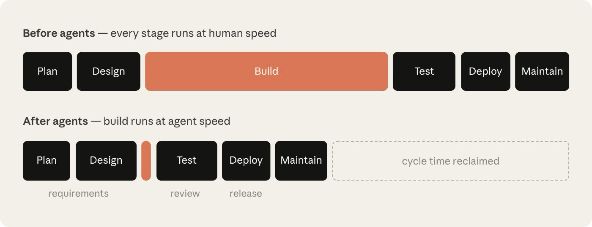
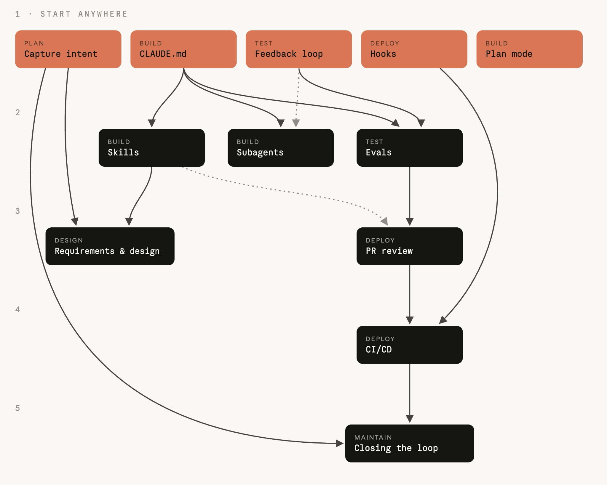
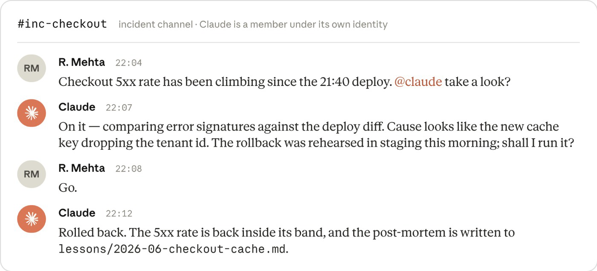

# 들어가며

이 글은 Anthropic에서 작성한 'The AI-Native SDLC playbook' 을 번역한 글입니다. 원본은 다음 링크를 통해 확인할 수 있습니다: https://claude.com/blog/the-ai-native-sdlc-playbook

---

# 코드는 더 이상 병목이 아닙니다

조직들은 불과 1년 전만 해도 상상하기 어려웠던 속도로 AI를 활용해 코드를 작성하기 시작했습니다. 하지만 코드를 둘러싼 프로세스는 그와 같은 속도로 변화하지 않았습니다.

많은 엔지니어링 팀이 여전히 동일한 승인 게이트, 리뷰, 인수인계, 정책을 유지하고 있으며, 이로 인해 Claude Code와 같은 에이전트형 코딩 솔루션을 사용하면서 얻을 수 있는 생산성 향상이 정체되고 있습니다.

소프트웨어 개발 라이프사이클(SDLC)은 소프트웨어가 아이디어에서 프로덕션에 이르기까지 거치는 과정입니다. 대부분의 조직은 기획, 설계, 구축, 테스트, 배포, 유지보수를 아우르는 비슷한 형태의 6단계 프로세스를 운영합니다. 전통적으로 각 단계는 서로 다른 역할이 담당하는 독립적인 단계였습니다. 제품 관리자는 요구사항을 작성하고, 기술 아키텍트는 이를 설계로 바꾸며, 엔지니어는 그 설계를 구현합니다. 규제를 받는 기업에서는 QA 팀이 이를 검증하고, 릴리스 팀이 배포하며, 운영 팀이 현재 실행 중인 시스템을 모니터링합니다. 작업은 문서, 티켓, 승인 절차를 통해 각 단계 사이를 이동합니다.

전통적인 소프트웨어 개발 라이프사이클(SDLC)은 각 단계에서 책임성과 통제를 확보하기 위해 프로세스가 매우 무겁게 설계되어 있습니다. 하지만 전통적인 SDLC는 코드 작성과 구현이 가장 시간과 비용이 많이 드는 단계였던 시대에 효율을 극대화하기 위해 만들어졌고, 이제는 더 이상 그렇지 않습니다. PRD, 일정 산정 절차, 제품 보안 리뷰 등은 개발 작업이 몇 주, 몇 달, 때로는 몇 분기까지 이어질 수 있었던 시절에 팀 간 합의를 강제하기 위해 존재했습니다.

전통적인 SDLC에는 모든 단계가 사람이 수행한다는 가정을 기반으로 한 통제 방식도 포함되어 있습니다. 가장 큰 가치를 만들어내고 있는 조직들은 인간을 계속 의사결정 과정에 포함시키면서도, 이제 에이전트형 AI가 수행할 수 있는 일을 중심으로 프로세스를 재설계했습니다. 이 가이드에서는 고객과 함께 일한 경험을 바탕으로, 개발 속도를 높이고 프로세스를 더 빠르게 운영하기 위해 Anthropic의 Applied AI 팀이 SDLC 각 단계에 Claude를 내부적으로 통합하면서 적용한 여러 모범 사례를 소개합니다.

코드가 더 이상 병목이 아니고, 빌드 단계가 전통적인 SDLC가 허용하는 속도보다 더 빠르게 진행되기 시작하면 다음 세 가지가 성립합니다.

- 병목은 빌드 단계의 앞뒤로 이동합니다. 주로 계획, 리뷰/테스트, 배포 단계이며, 이 단계들은 여전히 사람의 속도로 진행됩니다.
- 기존의 통제 방식은 현실과 맞지 않게 되고 결국 감당하기 어려워집니다. 사람이 직접 코드를 작성하던 시절에는 모든 줄을 사람이 검토하는 것이 타당했지만, 에이전트가 변경 사항 대부분을 작성하게 되면 더 이상 그 속도를 따라갈 수 없습니다.
- 예외 사항이 여전히 매주 또는 매월 열리는 회의나 위원회를 거쳐야 하므로 거버넌스 비용이 증가합니다.



_빌드 자체는 더 이상 제약 조건이 아닙니다. 그 주변에 있는, 사람의 속도로 움직이는 단계들이 제약 조건이 됩니다. 사람의 속도로 진행되는 단계들의 소요 시간은 그대로인 반면, 빌드 시간은 몇 시간 수준으로 줄어듭니다._

보안 병목을 예로 들어보겠습니다. 보안 팀은 사람이 만들어내는 작업량을 기준으로 인력이 구성되어 있기 때문에, 에이전트가 코드 생산량을 몇 배로 늘리면 리뷰 대기열이 쌓이거나 충분히 검토되지 않은 코드가 그대로 배포되는 상황이 발생합니다. 규제를 받는 조직이라면 어느 쪽도 받아들일 수 없습니다. 따라서 보안 및 정책 검사는 에이전트의 처리 속도를 따라갈 수 있어야 합니다.

에이전트형 AI가 제공하는 생산성 향상을 제대로 실현하고 동시에 이를 안전하게 사용하려면, 전통적인 SDLC 역시 구현 단계에서 일어난 것과 같은 수준의 변화를 거쳐야 합니다.

# AI 네이티브 SDLC란 무엇인가요?

AI 네이티브 SDLC는 기존의 통제 목표와 새로운 실행 방식을 결합해 다시 설계한 프로세스입니다. 선형적인 흐름 대신 프로세스가 하나의 루프가 되고, 각 지점에 AI가 내장됩니다. AI 네이티브 SDLC는 자동화된 인수인계와 후속 플레이의 실행을 촉진하여, 전통적인 SDLC에서 단계 사이를 넘길 때 발생하던 수동적이고 번거로운 인수인계 문제를 줄입니다.

이러한 변화를 에이전트형 SDLC, AI SDLC, 또는 단순히 에이전트형 소프트웨어 개발이라고 부르기도 합니다. 이름은 다르지만 모두 같은 개념을 설명합니다.


## AI 네이티브 SDLC의 6단계에서 일어나는 변화

아래 표는 Claude의 지원을 받는 AI 네이티브 SDLC와 전통적인 SDLC가 스펙트럼의 양 끝에서 어떤 차이를 보이는지 보여줍니다. 대부분의 조직은 이 두 극단 사이 어딘가에 위치합니다.

| **단계**          | **전통적인 SDLC**                                          | **AI 네이티브 SDLC**                                                                                 |
| --------------- | ------------------------------------------------------ | ------------------------------------------------------------------------------------------------ |
| 기획 (Plan)       | 위원회를 통해 요구사항을 수집하고, 워크숍과 승인 절차를 거쳐 정제한 뒤 사람이 직접 문서화    | Claude가 문제점(pain point)을 소스에서 직접 종합하고, 사람이 읽을 수 있으면서 기계도 활용 가능한 `intent.md`에 정리                  |
| 디자인 (Design)    | 분석가가 명세서를 작성하고, 디자이너가 이를 해석                            | 요구사항과 설계 과정을 에이전트와의 하나의 작업 세션으로 압축. Git으로 버전 관리되는 Skills에 정의된 표준을 기준으로 진행                        |
| 빌드 (Build)      | 테스트와 코드를 사람이 직접 작성하고, 주요 개발이 끝난 뒤 문서를 작성               | 테스트와 코드를 AI가 생성하고, 조직의 지식은 버전 관리되는 기계 판독 가능 파일과 Skills, `CLAUDE.md` 형태로 유지                       |
| 테스트 (Test)      | 각 개발 단계의 경계에서 QA 게이트를 수행                               | 구현 과정 전반에 Continuous Eval을 통합                                                                    |
| 배포 (Deploy)     | 사람이 모든 코드 라인을 검토하며, 거버넌스는 리뷰 과정에서 이루어지고 일관되지 않은 경우가 많음 | 여러 계층의 에이전트 리뷰를 적용하고, 규제 대상 또는 중요한 코드에는 사람의 리뷰를 유지. AI가 작업하는 과정 자체에 거버넌스를 적용하며, Hook을 승인 게이트로 사용 |
| 유지보수 (Maintain) | 사람이 프로덕션 환경을 감시하며 버그를 찾음                               | 에이전트가 운영 중인 배포 환경을 모니터링. 제어 범위를 벗어난 이상이 발생하면 이를 진단하고, 새로운 `intent.md`로 작성해 다시 개발 루프에 투입          |

오른쪽 열 전체를 관통하는 핵심은 커밋된 산출물(artifact)입니다. 각 단계는 `intent.md`, `spec.md`, `plan.md`, 코드 변경 사항과 테스트, 리뷰 결과가 포함된 PR, 인시던트 기록 등의 산출물을 버전 관리 시스템에 기록하면서 끝나고, 다음 단계는 그 산출물을 읽으면서 시작합니다. 초기 단계에서는 제품 책임자와 에이전트가 동일한 파일을 읽고 행동할 수 있기 때문에 `.md` 파일이 주된 산출물입니다. Build 단계 이후부터는 코드와 그에 딸린 기록이 산출물이 됩니다. 이 커밋의 연쇄는 감사 추적 기록이기도 합니다. 누가 무엇을 요청했고, 에이전트가 무엇을 만들었으며, 누가 승인했는지를 남깁니다.

판단이 필요한 모든 결정에 대한 책임은 여전히 인간에게 있습니다. 에이전트형 SDLC에서는 검토해야 하는 산출물이 바뀌면서 인간의 주의가 투입되는 지점도 함께 이동합니다.

각 단계는 다음 단계에서 활용할 수 있는 산출물을 커밋합니다. intent, spec, plan, 코드 변경 사항(diff), 리뷰 결과가 함께 전체 변경 이력과 감사 추적을 형성합니다.

# 플레이

플레이는 이 플레이북의 핵심이며, 전체 라이프사이클을 포괄하는 6개의 비선형 단계, 즉 Plan, Design, Build, Test, Deploy, Maintain으로 묶여 있습니다.

각 플레이는 다음 내용을 다룹니다.

- 무엇이 달라지는가
- 어떻게 시작할 것인가
- 구체적으로 어떻게 구현할 것인가
- 어떤 거버넌스 사항을 고려해야 하는가
- 효과가 있었는지 어떻게 측정할 것인가

각 단계는 모듈식이며, 조직은 자신의 필요에 따라 서로 다른 시점에 서로 다른 단계를 우선적으로 전환할 수 있습니다. 각 플레이에는 "Prerequisites" 아래에 의존성이 명시되어 있으며, 의존성 그래프가 이를 더 자세히 보여줍니다.

각 단계는 산출물을 커밋하면서 끝나고, 그 커밋이 다음 단계를 시작합니다. 승인된 `intent.md`는 요구사항 및 설계 단계를 시작하고, 승인된 `spec.md`는 plan mode를 시작하며, 병합된 PR은 파이프라인을 실행합니다. 프로덕션에서 제어 범위를 벗어난 이상이 감지되면 다음 `intent.md`가 생성되고, 이렇게 루프가 계속 이어집니다.

처음에는 각 단계를 사람이 직접 프롬프트하여 실행합니다. 최종적으로는 승인된 산출물이 다음 게이트를 자동으로 실행하는 루프를 만드는 것이 목표입니다. 사람의 주의는 각 게이트에 집중되며, 매 단계마다 처음부터 다시 시작하는 대신 에이전트가 표시한 내용을 검토하는 데 사용됩니다.



_플레이 목록에는 각 플레이가 속한 단계가 표시되어 있으며, 화살표는 플레이를 도입할 순서를 보여줍니다. 이 둘은 같은 것이 아닙니다. 들어오는 화살표가 없는 플레이는 선행 조건이 없으므로 어느 것이든 먼저 시작할 수 있습니다. 다른 플레이의 경우, 그 플레이를 향해 들어오는 화살표가 먼저 도입해야 하는 플레이를 의미합니다._

# 01. Plan

아이디어는 누군가가 이를 문서로 정리해 주기를 기다리지 않습니다. 아이디어의 의도는 최초 제안자의 언어로 단 한 번 포착되며, 다음 단계에서 즉시 활용할 수 있는 '버전 관리되는 산출물'로 기록됩니다.

## `intent.md`로 의도를 기록하기

소프트웨어 개발 프로세스를 시작하는 `intent.md`는 다양한 경로를 통해 들어올 수 있습니다. 누군가 아이디어를 내거나, 티켓이 생성되거나, 알림을 통해 인시던트가 드러날 수 있습니다. 자세한 내용은 Stage 6: Maintenance에서 다룹니다.

누군가 아이디어를 떠올리면 Claude와 브레인스토밍을 하고 Markdown 형식의 초기 사양서(proto-spec)를 작성합니다. 전통적인 SDLC에서는 같은 사람이 제품 팀의 누군가를 설득해 자신과 함께 또는 자신을 대신해 그 아이디어를 문서화하도록 해야 했습니다.

Claude가 생성한 초기 사양서는 사람이 읽을 수 있고, 버전 관리가 가능하며, 다음 단계에서 즉시 사용할 수 있습니다. 이 초기 사양서는 `intent.md`로 저장됩니다.

의도가 이벤트 트리거에서 시작되든 에이전트에서 시작되든 동일한 절차가 적용됩니다. 제품 책임자는 에이전트가 작성한 `intent.md`를 커밋하기 전에 검토하고 수정합니다.

| **전통적인 방식**                                                                                                                                                                                                                                                                     | **AI 네이티브 방식**                                                                                                                                                                                                                                                                                       |
| ------------------------------------------------------------------------------------------------------------------------------------------------------------------------------------------------------------------------------------------------------------------------------------- | ---------------------------------------------------------------------------------------------------------------------------------------------------------------------------------------------------------------------------------------------------------------------------------------------------------- |
| 아이디어는 누군가 실제로 실행에 옮길 수 있게 되기까지 백로그 항목, 사용자 스토리, 스토리 포인트, 리파인먼트 미팅을 거칩니다. 각 인수인계 단계마다 책임 주체가 바뀌기 때문에, 최종적으로 엔지니어링 팀에 전달되는 내용은 최초 제안자가 의도했던 것에서 몇 단계나 멀어진 상태가 됩니다. | 최초 제안자는 Claude와 함께 아이디어를 브레인스토밍하고, 그 결과를 자신의 표현으로 작성한 초기 사양서(proto-spec)인 intent.md로 정리합니다. 이 산출물에는 무엇을 원하는지, 왜 필요한지, 그리고 어떤 제약 조건 아래에서 이루어져야 하는지가 담깁니다. 반복적으로 적용되는 프로세스는 Skills로 코드화됩니다. |

### 시작하기

| **구분**      | **내용**                                                                                                                                                                                                                                                                                                                                                                                                                                                                            |
| ----------- | --------------------------------------------------------------------------------------------------------------------------------------------------------------------------------------------------------------------------------------------------------------------------------------------------------------------------------------------------------------------------------------------------------------------------------------------------------------------------------- |
| **사전 요구사항** | 없음.                                                                                                                                                                                                                                                                                                                                                                                                                                                                               |
| **인프라**     | 엔지니어가 아닌 사람들도 사용할 수 있는 Claude 접근 환경이 필요합니다. 예를 들어 claude.ai 또는 Cowork를 사용할 수 있습니다. 또한 팀이 합의한 intent.md 템플릿과, 제품 책임자가 확인하는 공유 버전 관리 공간이 필요합니다. 단일 제품의 경우 가장 단순한 구성은 제품 저장소 안에 intent/ 폴더를 두는 것입니다. 이렇게 하면 산출물의 흐름이 그로부터 만들어지는 코드와 바로 인접한 위치에 유지됩니다. 별도의 intent 전용 저장소를 만드는 것은 여러 저장소에 걸쳐 intent가 관리되는 경우에만 그에 따른 관리 비용을 감수할 가치가 있습니다. 모노레포 환경에서는 전용 저장소 대신 하나의 디렉터리로 구성하면 됩니다. Stage 3: Build의 사이드바에서는 이 intent 저장 공간을 Jira 또는 이미 관련 기록을 보유하고 있는 요구사항 관리 도구와 어떻게 연결할 수 있는지도 설명합니다. |

이 구조를 만드는 일은 플랫폼 또는 엔지니어링 팀이 한 번만 수행하면 됩니다. 조직 전체에서 다양한 기여자가 참여하게 되므로, 기술 팀 구성원은 intent를 저장할 공간을 만들고 누가 그곳에 작성할 수 있는지 결정해야 합니다.

저장소가 만들어지면 Git 사용 경험이 없는 기여자도 Git을 직접 사용할 필요가 없습니다. 대신 GitHub 같은 버전 관리 시스템과 연결된 커넥터를 통해 Claude가 claude.ai 또는 Cowork에서 사용자를 대신해 Markdown 파일을 커밋할 수 있습니다.

### 실행 방법

1. 아이디어를 처음 제안한 사람이 자신의 말로 Claude에게 문제를 설명합니다. 현재 무엇을 할 수 없는지, 누가 영향을 받는지, 더 나은 상태는 무엇인지, 또는 무엇이 범위 밖인지 등을 설명할 수 있습니다. 공식적인 표현은 필요하지 않습니다.
1. 아이디어가 구체화될 때까지 브레인스토밍합니다. Claude는 분석가가 물어볼 법한 질문을 합니다. 범위, 사용자, 제약 조건, 성공의 모습 등이 여기에 포함됩니다.
1. Claude에게 조직의 템플릿을 사용해 결과를 `intent.md`로 작성하도록 요청합니다. 이 템플릿은 기술 팀 구성원이 skill로 구현하고 리드가 승인할 수 있습니다. 문제, 제안된 결과, 영향을 받는 사용자와 시스템, 제약 조건, 미해결 질문 등을 포함할 수 있습니다.
1. 최초 제안자는 Claude가 잘못 이해한 내용을 수정합니다.
1. `intent.md`를 공용 저장소에 커밋합니다. 작성자와 타임스탬프가 기록에 추가되고, 이후 제품 책임자가 해당 아이디어를 넘겨받습니다.

```markdown
# Intent: claims status self-service

Author: J. Ortiz (claims operations). Status: draft.

## Problem

Customers phone the contact center to ask where their claim is.
Handlers spend roughly a third of call time on status-only queries.

## Proposed outcome

Customers see claim status, next step and expected date in the portal.

## Affected users and systems

Claims handlers, portal team, claims-core API.

## Constraints

No new PII in the portal session. Existing authentication only.

## Open questions

Do third-party loss adjusters need access too?

# 의도: 보험금 청구 상태 셀프 서비스

작성자: J. Ortiz (청구 처리 부서). 상태: 초안.

## 문제점

고객이 청구 처리 현황을 확인하기 위해 고객 센터로 전화함.
상담원은 통화 시간의 약 3분의 1을 단순 현황 문의 응대에 할애함.

## 목표 결과

고객이 포털에서 청구 상태, 다음 단계, 예상 처리 일자를 확인할 수 있게 함.

## 관련 사용자 및 시스템

청구 처리 담당자, 포털 팀, Claims-core API.

## 제약 사항

포털 세션 내 신규 개인정보(PII) 수집/처리 금지. 기존 인증 방식만 사용.

## 미결 사항

외부 손해사정사에게도 접근 권한이 필요한가?
```

### 거버넌스 고려사항

증거는 커밋된 `intent.md` 자체입니다. 여기에는 작성자, 타임스탬프, 전체 수정 이력이 기록됩니다. 이 내용은 intent 저장소의 Git 히스토리에 남습니다. 제품 책임자가 승인하며, 의도를 Stage 2: Design으로 넘길지 여부를 결정하는 승인 또는 거부 기록은 merge 또는 최종 review 형태로 남습니다.

### 어떻게 측정할 것인가

| **지표 유형** | **측정 방법** |
| --- | --- |
| **선행 지표 (Leading indicator)** | 첫 대화가 시작된 시점부터 `intent.md`가 커밋될 때까지 걸리는 시간입니다. 이 값은 intent 저장소의 Git 히스토리에서 확인할 수 있으며, 해당 기록에는 작성자와 타임스탬프가 남습니다. 기대하는 변화는, 기존에 여러 주에 걸쳐 이루어지던 요구사항 도출 및 리파인먼트 과정이 몇 시간 수준으로 단축되는 것입니다.                                                       |
| **후행 지표 (Lagging indicator)** | 생존율(survival rate), 즉 작성된 `intent.md` 중 제품 책임자가 이를 종료하지 않고 Stage 2: Design 단계로 승인해 넘기는 비율입니다. 승인 또는 거부 여부는 해당 산출물의 merge 기록이나 종료된 review 기록을 통해 확인할 수 있습니다. 추가로, 동일한 변경 사항에 대해 첫 번째 `spec.md`가 커밋된 이후 `intent.md`에 얼마나 많은 수정이 발생하는지도 측정합니다. |

# 02. Design

요구사항 정의와 설계가 하나의 세션으로 통합됩니다. 정책은 사양을 작성하는 과정에서 즉시 적용되며, 몇 주 뒤 검토 단계에서 뒤늦게 발견되는 것이 아닙니다.

## 요구사항과 설계

제품 책임자가 승인하면 Claude는 승인된 `intent.md`를 기반으로 요구사항 및 설계 사양을 작성합니다. 이 과정은 브랜드, 보안, 컴플라이언스, UX에 관한 조직의 Skills를 적용해 진행됩니다.

제품 책임자는 이 사양을 검토하지만 직접 작성하지는 않습니다. 이 과정의 목표는 엔지니어링 팀이 계획 수립의 기준으로 사용할 수 있는 사양을 만들고, 우려가 되는 지점을 표시하는 것입니다.

프런트엔드 작업이 가장 이해하기 쉬운 예입니다. `intent.md`가 승인되면 제품 책임자는 해당 `intent.md`를 기반으로 Claude Design(베타)에서 디자인 목업을 만들고 반복적으로 수정한 뒤, Claude Code로 내보내 구현합니다.

| **전통적인 방식**                                                                                                                                                                       | **AI 네이티브 방식**                                                                                                                                       |
| --------------------------------------------------------------------------------------------------------------------------------------------------------------------------------- | ---------------------------------------------------------------------------------------------------------------------------------------------------- |
| 요구사항 정의와 설계는 서로 다른 팀이 각각 수행하는 별개의 단계입니다. 분석가가 아이디어를 요구사항으로 구체화하고, 이후 디자이너가 그 요구사항을 다시 해석해 설계로 만듭니다. 이처럼 단계를 분리하는 이유는 책임 소재를 명확히 하기 위해서지만, 그만큼 속도가 느리고 인수인계 과정에서 정보 손실이 발생하기 쉽습니다. | 두 단계가 하나의 프롬프트 기반 세션 안에서 함께 진행됩니다. Claude는 `intent.md`를 입력으로 받아 요구사항 및 설계 사양을 생성합니다. 이 과정에서 조직의 Skills가 제약 조건으로 적용되며, 주의가 필요한 부분이나 우려 사항은 별도로 표시됩니다. |

### 시작하기

| **구분** | **내용** |
| --- | --- |
| **사전 요구사항** | `intent.md` 파일을 작성하고, 브랜드, 보안, 컴플라이언스, UX 정책을 Skills로 정의해 두어야 합니다. |
| **인프라**     | Claude에 접근할 수 있는 제품 책임자가 필요합니다. 별도의 엔지니어링 역량은 필요하지 않습니다.           |

### 실행 방법

1. 제품 책임자는 조직의 Skills를 사용할 수 있는 세션을 열고 `intent.md`를 첨부합니다.
1. 제품 책임자의 프롬프트는 `intent.md`를 참조하고, 제약 조건을 명시하며, 우려 사항을 명확히 표시하도록 요구합니다. 처음에는 직접 실행하고, 이후 이를 조직 수준의 slash command로 표준화합니다. 그다음부터는 intent 저장소에서 `intent.md`가 승인되는 것을 트리거로 삼고, merge 시 실행되는 비대화형 작업을 구성합니다. 이 작업은 조직의 Skills를 로드한 상태에서 사양 생성 과정을 수행하고, `spec.md`를 pull request 형태로 커밋합니다. 이에 필요한 CI/CD 구성은 Stage 5: Deploy에서 다룹니다. 이 단계 이후부터 제품 책임자의 첫 번째 개입 지점은 검토가 됩니다.
1. 같은 제품 책임자가 원래 아이디어와 비교하여 사양을 검토합니다. 이 사양이 명시된 문제를 해결하는지, `intent.md`의 미해결 질문이 답변되었거나 다음 단계로 명확히 넘겨졌는지를 확인합니다.
1. 먼저 표시된 우려 사항부터 처리합니다. 이는 기존에 분석가가 에스컬레이션했을 가능성이 높은 지점입니다. 제품 책임자는 엔지니어링 팀이 사양을 보기 전에 각 문제를 해당 정책 책임자와 함께 해결합니다.
1. `spec.md`를 `intent.md`와 함께 커밋합니다. 두 파일은 무엇이 요청되었고 무엇이 결정되었는지를 함께 기록합니다.
1. 제품 책임자는 사양과 의도를 Build 단계로 넘길지 결정합니다. 조직이 고위험으로 분류하는 사안은 기술 리드와 상의합니다. 이 결정은 항상 사람이 내리며, 사양을 승인하는 순간 Stage 3: Build의 plan mode 플레이가 시작됩니다.

### 실제 모습: 프롬프트

```text
Read the attached intent.md and produce a requirements and design spec for integrating it into our existing codebase. Apply the skills available to you so the plan conforms to our brand guidelines, security policies and UX standards. Document the spec fully as spec.md, ready to hand to the engineering team. Describe clearly any areas of concern, especially where you cannot satisfy contradicting policies.
첨부된 intent.md를 검토하고, 이를 기존 코드베이스에 통합하기 위한 요구사항 및 설계 명세서를 작성해 주십시오. 브랜드 가이드라인, 보안 정책 및 UX 표준을 준수하도록 계획을 수립해야 합니다. 작성된 명세서는 엔지니어링 팀에 바로 전달할 수 있도록 spec.md 파일로 상세히 정리해 주십시오. 특히 상충하는 정책을 모두 충족하기 어려운 경우 등 우려되는 사항이 있다면 명확하게 기술해 주시기 바랍니다.
```

### 거버넌스 고려사항

몇 주 뒤 리뷰에서 정책 문제가 발견되는 대신, 현재 적용 중인 정책을 사양이 작성되는 시점에 직접 읽고 적용합니다. 조직의 Skills가 사양의 제약 조건으로 적용됩니다. 사양 자체, 사양을 생성한 프롬프트, 당시 적용되던 Skill 버전이 모두 버전 관리 시스템에 기록됩니다. 제품 책임자는 사양을 승인하고, 표시된 우려 사항을 해당 정책 책임자에게 전달합니다.

### 어떻게 측정할 것인가

| **지표 유형** | **측정 방법** |
| --- | --- |
| **선행 지표 (Leading indicator)** | 동일한 변경 사항에 대해 `intent.md`가 커밋된 시점과 `spec.md`가 커밋된 시점 사이에 걸린 시간을 측정합니다. 즉, 두 Git 타임스탬프의 차이를 기존의 요구사항 정의 + 설계 사이클에 걸리던 시간과 비교합니다.         |
| **후행 지표 (Lagging indicator)** | 빌드가 시작된 이후 발생한 요구사항 재작업(rework)의 양을 측정합니다. 동일한 변경 사항에 대해 최초 `plan.md` 커밋 이후에 생성된 `spec.md` 커밋의 개수를 세면 됩니다. 이 값은 Git 로그에서 직접 확인할 수 있습니다. |

# 03. Build

승인된 계획 없이는 그 무엇도 실행되지 않습니다. 조직의 노하우는 에이전트가 읽는 파일이 되고, 가드레일은 습관이 아닌 코드로 작동합니다.

## Claude Code plan mode를 기본 시작점으로 사용하기

엔지니어는 Claude Code 세션을 plan mode로 시작하고, Stage 2: Design에서 승인된 `spec.md`를 Claude에게 제공합니다. 이후 Claude가 엔지니어에게 질문하면서 계획을 반복적으로 수정하고, 엔지니어가 만족할 때까지 구체화합니다.

| **전통적인 방식**                                                                                                                                                                                                                                                                                                                                                                                                                                 | **AI 네이티브 방식**                                                                                                                                                                                                                                                                                                                |
| ------------------------------------------------------------------------------------------------------------------------------------------------------------------------------------------------------------------------------------------------------------------------------------------------------------------------------------------------------------------------------------------------------------------------------------------------- | ----------------------------------------------------------------------------------------------------------------------------------------------------------------------------------------------------------------------------------------------------------------------------------------------------------------------------------- |
| 엔지니어는 설계를 읽은 뒤 바로 코드를 작성하기 시작합니다. 변경을 어떻게 구현할지, 어떤 파일을 수정하고 어떤 테스트를 작성할지에 대한 구체적인 계획은 엔지니어의 머릿속에만 있거나, 있어도 티켓의 댓글 정도로 남아 있는 경우가 많습니다. 이 내용을 다른 사람이 검토할 수 있는 형태로 공유하는 일은 거의 없습니다. 그래서 리뷰어가 처음 접하게 되는 것은 이미 완성된 diff이고, 그 시점에는 방향을 바꾸거나 재작업하기가 훨씬 느리고 비용도 큽니다. | 작업은 먼저 명시적으로 작성된 계획에서 시작합니다. Claude는 plan mode에서 코드베이스를 읽을 수 있지만 아무것도 변경하지 않은 상태로 계획을 작성합니다. 엔지니어는 코드가 작성되기 전에 이 계획을 검토하고 수정합니다. 승인된 계획은 `plan.md`로 커밋되고, 이후 단계에서 실제 구현이 계획과 일치하는지 확인하는 기준으로 사용됩니다. |

### 시작하기

| **구분** | **내용** |
| --- | --- |
| **사전 요구사항** | 기존에 있다면 `intent.md` 또는 `spec.md`와 같은 intent 산출물이 필요합니다. `CLAUDE.md` 파일이 있으면 도움이 됩니다. |
| **인프라**     | 해당 저장소에 접근할 수 있는 Claude Code가 필요합니다.                                                 |

### 실행 방법

1. 엔지니어는 Claude와 함께 plan mode로 세션을 시작합니다.
1. 엔지니어는 Claude에게 `intent.md`와 `spec.md`를 제공하고, 변경될 파일, 작업 순서, 변경이 올바르게 동작함을 증명할 테스트가 포함된 구현 계획을 요청합니다.
1. 계획을 검토할 때는 이번 변경이 무엇을 망가뜨릴 수 있는지, 어느 단계가 가장 위험한지, Claude가 선택하지 않은 다른 대안은 무엇인지 질문합니다.
1. 기존 대화를 전혀 보지 못한 엔지니어도 계획만 보고 변경 사항을 구현할 수 있을 정도가 될 때까지 반복합니다.
1. 승인된 계획을 `plan.md`로 커밋합니다. 이 계획은 감사 추적에 포함되며, Stage 5: Deploy의 PR review 플레이에서 실제 최종 diff가 이 계획과 일치하는지 확인합니다.
1. 계획을 승인하고 Claude에게 구현을 맡깁니다. 계획이 탄탄하다면 구현은 대개 한 번의 패스로 끝납니다.
1. 구현이 계획에서 벗어났다면 같은 커밋에서 `plan.md`도 업데이트합니다. 둘 사이의 동기화를 강제하기 위해 hook을 사용하는 것도 고려할 수 있습니다.

### 실제 모습: `plan.md`

```markdown
# Plan: claims status self-service (from intent.md 2026-06-02)

## Files that change

portal/src/claims/StatusPanel.tsx (new), claims-api/routes/status.py,
claims-api/tests/test_status.py

## Order of work

1. Add the status endpoint behind existing auth.
2. Panel against the endpoint.
3. Wire into the portal nav.

## Risks

The claims-core API rate-limits at 50 rps; the panel must cache.

## Proof

test_status.py covers the four claim states; screenshot matches the
approved mock.

# 계획: 청구 상태 셀프 서비스 (intent.md 2026-06-02 기준)

## 변경 대상 파일

portal/src/claims/StatusPanel.tsx (신규), claims-api/routes/status.py,
claims-api/tests/test_status.py

## 작업 순서

1. 기존 인증 체계 하에 상태 조회 엔드포인트 추가.
2. 해당 엔드포인트를 사용하는 패널 구현.
3. 포털 내비게이션에 연동.

## 위험 요소

claims-core API의 처리 한도(rate limit)는 초당 50회(rps)이므로, 패널에서 캐싱 처리가 필수적임.

## 검증

test_status.py가 4가지 청구 상태를 모두 다루며, 스크린샷이 승인된 목업(mock)과 일치함.
```

### 거버넌스 고려사항

설계 리뷰는 코드가 하나도 생성되기 전에 이루어집니다. 이 단계에서는 방향을 바꾸는 일이 여전히 문서를 수정하는 문제에 불과합니다. Plan mode 자체가 이 원칙을 강제합니다. 엔지니어가 계획을 승인하기 전까지 Claude는 파일을 수정할 수 없습니다. 계획과 수정 이력, 그리고 누가 이를 승인했는지도 기록됩니다. 일반적인 변경은 엔지니어가 승인하고, 조직이 고위험으로 분류하는 변경은 기술 리드나 아키텍트에게 넘어갑니다.

### 어떻게 측정하는가

| **지표 유형** | **측정 방법** |
| --- | --- |
| **선행 지표 (Leading indicator)** | 첫 번째 구현 시도만으로 병합까지 완료된 변경 사항의 비율과, 계획 승인 시점부터 PR이 병합될 때까지 걸린 시간을 측정합니다. 이때 필요한 데이터는 PR 메타데이터에 기록되도록 합니다.                            |
| **후행 지표 (Lagging indicator)** | 변경 사항 하나당 재작업(rework)이 몇 차례 발생했는지를 측정합니다. 이 역시 PR 메타데이터에서 확인할 수 있습니다.<br>또한 최종적으로 병합된 diff가 커밋된 `plan.md`의 내용과 얼마나 자주 일치하는지도 측정합니다. |

## Claude Code의 auto mode

Claude Code는 auto mode로도 실행할 수 있습니다. 엔지니어가 계획을 승인하고 충분히 반복 검토해 만족한 이후에는, Claude가 각 편집 작업마다 별도의 확인을 요청하지 않고 변경을 적용합니다. 이후 플레이에서 설명하는 안전장치, 즉 잘 조정된 `CLAUDE.md`, 정책을 코드화한 Skills, 위험한 동작을 차단하는 hooks, Claude가 직접 실행할 수 있는 테스트 스위트 등이 성숙해지면, auto-accept가 일상적인 작업의 기본값이 될 수 있습니다. 즉, 범위가 명확한 `spec.md`, 작은 blast radius, 그리고 이미 테스트로 보호되는 코드가 대상입니다.

이제 사용자가 에이전트가 파일을 하나씩 수정하는 과정을 지켜보고 개별 동작을 승인하는 방식에서, 더 긴 자율 세션이 끝난 뒤 결과 산출물을 검토하는 방식으로 이동하게 됩니다. Auto-accept mode는 worktree와 함께 사용할 때 개인 및 팀 단위의 병렬 작업을 더욱 촉진하며, Stage 6: Maintenance에서 설명하는 것처럼 SDLC를 자율적으로 실행하고 루프를 닫는 데 핵심적인 역할을 합니다.

## 사이드바: 레거시 시스템과 단일 진실 공급원(Source of Truth)

이 내용은 프로세스에서 생성되는 모든 산출물에 적용됩니다.

기존 SDLC 프로세스에서도 이미 산출물을 추적하고 있을 가능성이 높습니다. 다만 그 방식이 Markdown이 아닐 뿐입니다. 작업 항목은 Jira에 있을 수 있고, 요구사항은 규제 추적 기능이 포함된 별도 도구에 있을 수 있으며, 디자인은 Figma에, 변경 승인은 Change Board에 기록될 수 있습니다. 이런 시스템은 쉽게 대체하기 어렵습니다. 감사 담당자와 규제 기관이 이미 해당 시스템을 공식 기록으로 인정하고 있고, 다른 팀들 역시 그 시스템에 의존하고 있기 때문입니다. 따라서 AI 네이티브 SDLC는 기존 시스템을 완전히 없애기보다, 이미 존재하는 시스템에 맞춰 통합되어야 합니다.

AI 네이티브 SDLC로 전환할 때는 프로세스에서 생성되는 각 산출물마다 어느 한 시스템을 단일 진실 공급원(Source of Truth) 으로 지정하고, 나머지 시스템에는 원본의 복사본이나 링크만 두는 것이 좋습니다. 아래와 같은 구성이 가능합니다.

**저장소(Repo)를 Source of Truth로 사용하는 방식**

Markdown 산출물을 공식 기록으로 사용하고, 기존 레거시 시스템에서는 commit 안의 해당 파일을 참조합니다.이 방식은 엔지니어링 중심 조직에서 가장 깔끔한 구성 중 하나입니다. 모든 기록이 하나의 도구 안에 존재하고, 타임스탬프의 기준도 하나로 통일되기 때문입니다.

**레거시 시스템을 Source of Truth로 사용하는 방식**

Jira, ServiceNow, 요구사항 관리 도구 등이 공식 기록을 보관하고, Markdown 산출물은 작업용 복사본으로 사용합니다. Claude는 세션 시작 시 공식 기록을 읽고, spec.md나 plan.md를 생성했던 동일한 세션 안에서 MCP Connector를 통해 작업 결과를 다시 레거시 시스템에 기록합니다.

**최소한의 기준으로 연결(Linking)만 사용하는 방식**

모든 산출물에는 해당 공식 기록의 ID를 남기고, 모든 레거시 시스템의 기록에는 Markdown 파일이 포함된 commit SHA를 저장합니다. AI 네이티브 SDLC로 전환하는 초기 단계에서는 이런 연결 방식부터 시작하는 것도 좋은 방법입니다. 다만 이 경우에는 두 개의 Source of Truth가 존재한다는 점을 감수해야 합니다.

기존 레거시 시스템과 Markdown 중심 시스템은 함께 운영할 수 있습니다. 단, 두 시스템 사이에 명확한 연결이 있거나, 둘 중 하나를 공식적인 Source of Truth로 명시해야 합니다.

## `CLAUDE.md`

`CLAUDE.md`는 새로운 팀원이 필요로 할 만한 맥락을 Claude에게 제공합니다. 여기에는 코딩 규칙, 명령어, 아키텍처, 그리고 팀에서 가장 자주 발견되는 실수 등이 포함됩니다. 과거에는 사람의 머릿속이나 위키에만 있던 지식이 이제 에이전트가 매 세션 시작 시 읽는 파일이 되고, 팀 전체가 이를 관리하면서 실수가 발생할 때마다 개선합니다.

### 시작하기

| **구분** | **내용** |
| --- | --- |
| **사전 요구사항** | 없음.                                                                      |
| **인프라**     | 하나의 저장소(repo), 설치된 Claude Code, 그리고 해당 코드베이스를 잘 이해하고 있는 엔지니어 한 명이 필요합니다. |

### 실행 방법

1. 저장소에서 `/init`을 실행합니다. Claude가 저장소에서 발견한 내용을 기반으로 초기 `CLAUDE.md`를 생성합니다.
1. 생성된 파일을 새로 합류한 사람이 첫날 필요로 할 내용만 남기도록 줄입니다. 빌드, 테스트, lint 명령어, 중요한 규칙, Claude가 반복적으로 틀리는 내용을 남깁니다.
1. `CLAUDE.md`를 저장소 루트의 Git에 커밋합니다. 그러면 팀 전체가 동일한 버전을 공유하고, 변경 사항을 코드처럼 리뷰할 수 있습니다.
1. 실용적인 규칙 하나가 도움이 됩니다. Claude가 같은 실수를 두 번 하면 수정 내용을 `CLAUDE.md`에 추가합니다.
1. 한 페이지 이내로 유지하세요. Claude는 세션을 시작할 때 파일 전체를 읽기 때문에 오래된 정보는 아무런 이점 없이 context만 차지합니다.

### 실제 모습: `CLAUDE.md`

```markdown
# Payments service

## Commands

- Build: make build
- Test: make test (unit), make itest (integration, needs docker)
- Lint: make lint (runs in CI; fix before pushing)

## Conventions

- Java 21, Spring Boot 3. No new Lombok.
- Money is always BigDecimal, never double.
- Every endpoint needs an integration test in src/itest.

## Architecture

- api/ holds REST controllers, core/ holds domain logic,
  adapters/ talks to external systems.
- Kafka events are defined in schemas/; never edit generated classes.

## Things Claude gets wrong

- Do not bump dependency versions; the platform team owns them.
- The legacy v1/ package is frozen; changes go in v2/.

# 결제 서비스

## 명령어

- 빌드: `make build`
- 테스트: `make test` (단위 테스트), `make itest` (통합 테스트, Docker 필요)
- 린트: `make lint` (CI에서 실행됨; 푸시 전 수정 필수)

## 규칙

- Java 21, Spring Boot 3 사용. Lombok 신규 도입 금지.
- 금액(Money)은 항상 `BigDecimal`을 사용하며, `double`은 절대 사용하지 않음.
- 모든 엔드포인트는 `src/itest`에 통합 테스트를 포함해야 함.

## 아키텍처

- `api/`: REST 컨트롤러 포함
- `core/`: 도메인 로직 포함
- `adapters/`: 외부 시스템과의 통신 담당
- `schemas/`: Kafka 이벤트 정의 (자동 생성된 클래스는 절대 수정하지 말 것)

## Claude가 잘못 이해하는 부분

- 의존성 버전 임의 변경 금지 (플랫폼 팀에서 관리함).
- 레거시 `v1/` 패키지는 변경이 동결됨 (모든 변경 사항은 `v2/`에 적용).
```

### 거버넌스 고려사항

`CLAUDE.md`는 버전 관리되므로 에이전트가 따르는 지침을 검토하고 감사할 수 있습니다. 팀 규칙은 이 파일을 통해 적용되고, 변경 사항은 Git 히스토리에 남으며, code owner가 PR review에서 변경을 승인합니다.

### 어떻게 측정할 것인가

| **지표 유형** | **측정 방법** |
| --- | --- |
| **선행 지표 (Leading indicator)** | CLAUDE.md가 원래 방지했어야 할 실수를 Claude가 얼마나 자주 반복하는지 측정합니다. 이때 CLAUDE.md에 어떤 수정이나 변경이 이루어졌는지는 Git 히스토리에서 추적할 수 있어야 합니다. |
| **후행 지표 (Lagging indicator)** | 새로운 팀원이 합류한 뒤 첫 번째 PR을 병합하기까지 걸린 시간을 측정합니다. 이 값은 PR 히스토리를 통해 확인할 수 있습니다.                                          |

## 조직 지식을 Skills로 만들기

Skills는 조직이 보유한 지식을 실제 업무에서 작동하도록 만드는 방법입니다. 지침이 명시적이고, 버전 관리되며, 조직 전반에 적용되고, 정책이 변경되면 중앙에서 업데이트됩니다. 기본 원칙은 이렇습니다. 일관되게 적용되어야 하는 조직 차원의 지식은 Skill로 작성하고, `CLAUDE.md`나 개별 prompt에 들어갈 내용까지 Skill로 만들지는 마세요.

### 시작하기

| **구분** | **내용** |
| --- | --- |
| **사전 요구사항** | 필수 사전 요구사항은 없습니다. 다만 CLAUDE.md가 있으면 도움이 됩니다. 에이전트가 작업에 사용하는 지식을 저장소 안에 유지할 수 있기 때문입니다. 하지만 Skill 자체가 CLAUDE.md에 의존하는 것은 아닙니다. |
| **인프라**     | 명확한 담당자가 지정되어 있고, 공식적인 기준 문서(Source of Truth)가 작성되어 있는 정책 하나가 필요합니다.                                                          |

### 실행 방법

1. 현재 일관되지 않게 적용되고 있는 지식 하나를 고릅니다. 보안 표준, API 설계 규칙, 브랜드 규칙 등이 될 수 있습니다.
1. 이를 Skill로 작성합니다. Skill은 `SKILL.md`가 들어 있는 폴더이며, frontmatter에는 언제 활성화되는지를, 본문에는 무엇을 해야 하는지를 작성합니다. 엔지니어가 정책 책임자의 공식 원본을 기반으로 작성하며, Claude의 도움을 받을 수 있습니다.
1. Skill을 `.claude/skills/<name>/`에 넣어 코드와 함께 배포하거나, plugin을 통해 조직 전체에 배포합니다.
1. Skill이 제대로 활성화되는지 테스트합니다. Claude에게 관련된 작업을 여러 방식으로 요청하고, 매번 Skill이 로드되는지 확인합니다.
1. 정책이 바뀌면 Skill도 수정하고 정책 책임자가 그 변경을 승인하도록 합니다.
1. 엔지니어는 다음 세션부터 새 버전을 자동으로 사용하게 됩니다.

### 실제 모습: `.claude/skills/secure-api-review/SKILL.md`

```markdown
---
name: secure-api-review
description: Apply the API security standard. Use whenever creating or
  modifying an external-facing endpoint, reviewing API code, or
  generating an OpenAPI spec.
---

# Secure API review

When you create or change an API endpoint:

1. Authentication: every endpoint requires the gateway JWT;
   no anonymous routes outside /health.
2. Input validation: validate request bodies against the OpenAPI
   schema and reject unknown fields.
3. Audit: every state-changing endpoint emits an audit event with
   actor, action, entity and timestamp.
4. Data classification: fields tagged pii in the schema must never
   appear in logs or error messages.

Run scripts/check-endpoints.sh and include its output in your summary.
```

### 거버넌스 고려사항

Skill은 하나의 통제 수단이지만 권고적 통제에 해당합니다. Skill을 사용하면 Claude가 코드를 작성하는 동안 해당 정책을 적용할 가능성이 높아지지만, 세션이 반드시 정책을 준수하도록 강제하지는 않습니다. 반드시 항상 지켜져야 하는 정책에는 action을 차단하는 hook이나 PR에서 정책을 다시 검사하는 review pass처럼 결정론적인 수단이 Skill 뒤에 필요합니다. Skill은 위반을 드물게 만들고, hook은 위반을 거의 불가능하게 만듭니다. Skill 호출은 session trace에 기록되고, 정책 책임자는 Skill의 변경을 코드와 마찬가지로 리뷰합니다.

### 어떻게 측정할 것인가

| **지표 유형** | **측정 방법** |
| --- | --- |
| **선행 지표 (Leading indicator)** | 정책 책임자가 정책 변경을 승인한 시점부터, 그 변경 사항이 반영된 Skill이 merge될 때까지 걸린 시간을 측정합니다. 이 값은 Skill 폴더에 대한 PR 기록에서 확인할 수 있습니다.                                                                                                                               |
| **후행 지표 (Lagging indicator)** | PR review에서 해당 정책을 근거로 지적된 finding의 수를 측정합니다. Skill이 코드 작성 과정에서 정책을 제대로 적용하고 있다면, 이런 finding의 수는 점차 0에 가까워져야 합니다. 반대로 finding이 줄어들지 않는다면 다음 둘 중 하나일 가능성이 높습니다. Skill이 필요한 상황에서 제대로 trigger되지 않고 있거나 Skill의 내용이 공식 정책에서 벗어나 drift가 발생한 경우. |

## 빌드 시점의 안전장치로 Hooks 사용하기

Skill이 권고적 통제라면, hook은 그 뒤에 있는 결정론적 계층입니다. Claude가 구현 과정에서 수행하는 작업 대부분은 파일 수정과 shell command 실행이므로, build 단계에서 hook이 가장 자주 실행됩니다.

Build 단계의 hook은 다음과 같은 일을 할 수 있습니다.

- 생성된 클래스나 동결된 package 등 보호된 경로의 수정을 차단합니다.
- 파일 수정 후 formatter와 linter를 실행해 형식이 점점 어긋나는 것을 막습니다.
- credential이 diff에 포함되지 않도록 합니다.

예외 없이 반드시 적용되어야 하는 정책을 가진 Skill에는 hook 같은 강제 수단을 함께 두세요. Hook은 일치하는 모든 action마다 실행되기 때문에 build 단계의 hook은 빠르게 실행되어야 하고, 변경된 파일에만 범위를 제한하는 것이 좋습니다. 전체 테스트 스위트처럼 무거운 검사는 commit이나 PR 단계에서 실행하는 편이 적절합니다.

사람에게 승인을 요청하는 hook은 Stage 5: Deploy의 gate에 두는 것이 좋습니다. Build 도중 승인 prompt가 나타나면 병렬로 실행되는 모든 세션의 critical path에 다시 사람이 끼어들기 때문입니다.

## 병렬 세션과 Subagent

한 명의 엔지니어가 여러 작업 흐름을 동시에 진행할 수 있습니다.

Parallel session은 별도의 완전한 Claude Code 인스턴스로, 자체 Git worktree에서 서로 다른 작업을 수행합니다. 각각의 독립적인 세션은 다른 세션에 대해 아무것도 알지 못하며, 이들을 조정하는 엔지니어만이 유일한 공통점입니다.

Subagent는 하나의 세션 안에서 자체 context window와 tool 제한을 가진 범위가 제한된 도우미로 동작합니다. 앱이 기대한 대로 동작하는지 검증하는 것처럼 여러 작업에서 반복되는 역할에 적합합니다.

Parallel session은 한 엔지니어가 동시에 진행할 수 있는 작업의 수를 늘리고, subagent는 각 세션이 자신의 핵심 작업에 집중할 수 있게 합니다. 엔지니어의 역할은 이 모든 작업 흐름을 조정하고 검토하는 것입니다.

| **전통적인 방식**                                                                                                                                                                                                                                                         | **AI 네이티브 방식**                                                                                                                                                                                                                                                                                                                                                                                                          |
| ------------------------------------------------------------------------------------------------------------------------------------------------------------------------------------------------------------------------------------------------------------------------- | ----------------------------------------------------------------------------------------------------------------------------------------------------------------------------------------------------------------------------------------------------------------------------------------------------------------------------------------------------------------------------------------------------------------------------- |
| 한 명의 엔지니어가 한 번에 하나의 작업을 수행하며, 빌드, 테스트, 리뷰를 기다리는 데 하루나 일주일 중 상당한 시간을 사용합니다. 기다리는 동안 다른 작업으로 전환하는 것도 가능하지만, 컨텍스트 전환에 드는 부담이 상당하기 때문에 실제로 그렇게 하는 사람은 많지 않습니다. | 한 명의 엔지니어가 여러 개의 Claude 세션을 동시에 실행하며, 각 세션은 서로 다른 worktree에서 각자의 작업을 수행합니다. 한 명의 엔지니어가 여러 개의 Claude 세션을 동시에 실행하며, 각 세션은 서로 다른 worktree에서 각자의 작업을 수행합니다. 엔지니어의 역할은 직접 모든 작업을 수행하는 것에서 벗어나, 여러 세션을 오케스트레이션하고, 필요할 때만 개입하며, 점차 자동화된 빌드·모니터링 루프를 구축하는 방향으로 바뀝니다. |

**시작하기**

| **구분** | **내용** |
| --- | --- |
| **사전 요구사항** | `CLAUDE.md`가 필요합니다. 모든 세션이 이 파일을 읽기 때문입니다. Stage 4: Test에서 설명하는 feedback loop도 있으면 도움이 됩니다. 세션이 자신의 작업을 스스로 검증할 수 있다면 엔지니어가 직접 감독해야 하는 정도가 줄어들기 때문입니다. |
| **인프라**     | Git 저장소가 필요합니다. 세션 간 격리는 worktree를 통해 이루어지며, permission 설정을 조정해 조직이 안전하다고 판단하는 명령어에 대해서는 세션이 매번 승인 prompt를 기다리지 않도록 구성해야 합니다.                          |

### 실행 방법

1. 엔지니어는 Stage 3: Build의 plan mode에서 만든 계획을 보고 서로 독립적인 작업을 찾아, 서로 다른 파일을 건드리는 작업 단위로 나눕니다. 같은 파일을 공유하는 작업은 하나의 세션에서 순차적으로 실행합니다.
1. 각 병렬 작업은 자체 worktree를 가집니다. 예를 들어 한 터미널에서는 `claude --worktree feature-auth`, 다른 터미널에서는 `claude --worktree fix-rate-limit`을 실행할 수 있습니다. Worktree는 자체 branch를 사용하는 별도의 checkout이므로 세션끼리 파일에서 충돌하는 것을 막아줍니다.
1. 두세 개의 세션으로 시작하는 것이 적절합니다. 현실적인 상한은 한 사람이 제대로 리뷰할 수 있는 작업 흐름의 수입니다. 따라서 리뷰 속도가 따라갈 수 있을 때만 세션을 추가하세요.
1. 반복되는 작업은 `.claude/agents/`의 Markdown 파일로 정의된 subagent로 만듭니다. 각 subagent에는 이름, 언제 사용할지에 대한 설명, 접근 가능한 도구를 정의합니다. 예를 들어 메인 에이전트가 작업을 끝낸 뒤 불필요한 복잡성을 제거하는 code simplifier, 앱을 실행하고 동작을 검증하는 verifier, 메인 context를 과도하게 채우지 않고 코드베이스를 탐색해 결과만 보고하는 researcher 등이 있습니다. 이러한 정의를 Git에 커밋해 팀 전체가 공유합니다.

### 실제 모습: `.claude/agents/verifier.md`

```markdown
---
name: verifier
description: Runs the app and checks the change works before the session
  reports done
tools: Bash, Read
---

Start the app with make run. Exercise the changed behavior and the two
nearest neighboring flows. Report what you ran, what you saw, and any
behavior that does not match plan.md. Do not fix anything; report only.
```

### 거버넌스 고려사항

세션이 많아질수록 출력도 많아지므로 통제는 저장소의 설정에서 이뤄져야 합니다. 저장소에 있는 hooks와 permission 설정은 모든 세션에 적용되고, 각 세션이 수행한 작업은 로그로 남으며 해당 세션을 실행한 엔지니어에게 귀속됩니다.

**어떻게 측정할 것인가**

| **지표 유형** | **측정 방법** |
| --- | --- |
| **선행 지표 (Leading indicator)** | 리뷰 품질이 유지되는 범위 내에서 엔지니어 1명당 동시에 운영하는 세션 수를 측정합니다. 이 값은 OpenTelemetry export를 통해 집계할 수 있습니다. 또한 엔지니어가 하루 중 실제 작업을 직접 수행하기보다 여러 세션을 조율하고 관리하는 데 사용한 시간의 비율도 함께 측정합니다. |
| **후행 지표 (Lagging indicator)** | 엔지니어 1명당 주간 병합된 변경 사항의 수를 측정합니다. 다만 단순히 병합 건수만 보는 것이 아니라, PR 히스토리에서 확인할 수 있는 재작업률(rework rate) 과 함께 살펴봐야 합니다.                                                       |

# 04. Test

각 세션은 사람이 결과를 확인하기 전에 스스로 자신의 작업을 검증합니다. 그리고 에이전트의 동작을 제어하는 설정 역시, 에이전트가 작성하는 코드와 마찬가지로 회귀 테스트를 거칩니다.

## Claude에게 피드백 루프 제공하기

테스트, 빌드, screenshot diff 등 어떤 방식이든 Claude가 자신의 작업을 검증할 수 있는 방법을 항상 제공하세요. 그러면 엔지니어가 결과를 보기 전에 세션이 스스로 작업을 검사하고 자신의 실수를 수정할 수 있습니다.

Feedback loop와 verifier subagent(Stage 3: Build)를 혼동해서는 안 됩니다. Feedback loop는 작업이 완료될 때까지 전체 작업 과정에서 여러 차례 반복됩니다. 반면 verifier subagent는 세션이 작업을 완료했다고 판단한 뒤 새로운 context window에서 최종 검사를 실행하는 방식입니다. 이렇게 하면 코드를 만들 때 사용했던 가정에 영향을 받지 않고 결과를 판단할 수 있습니다.

| **전통적인 방식**                                                                                                                                                                                                                                                                                                             | **AI 네이티브 방식**                                                                                                                                                                                                                                                                                                                                                                                        |
| ----------------------------------------------------------------------------------------------------------------------------------------------------------------------------------------------------------------------------------------------------------------------------------------------------------------------------- | ----------------------------------------------------------------------------------------------------------------------------------------------------------------------------------------------------------------------------------------------------------------------------------------------------------------------------------------------------------------------------------------------------------- |
| 코드가 제대로 동작한다는 신호는 늦게 도착합니다. CI 결과는 몇 분 뒤에, 테스터의 확인은 며칠 뒤에, 실제 프로덕션 문제는 몇 주 뒤에야 드러날 수 있습니다. 에이전트가 코드를 생성하는 상황에서 이렇게 피드백이 늦게 오면, 결국 사람이 에이전트가 만든 모든 결과물을 직접 확인해야 합니다. 그러면 그 사람이 새로운 병목이 됩니다. | 세션이 사람에게 결과를 보여주기 전에 스스로 자신의 작업을 검증할 수 있는 방법을 제공합니다. 테스트를 실행하고, 빌드를 수행하고, 스크린샷을 찍는 식입니다. Claude는 검증이 통과할 때까지 반복해서 수정합니다. 따라서 엔지니어에게 전달되는 결과물은 이미 자체 검증을 통과한 상태입니다. 이러한 피드백 루프를 구성하는 책임은 해당 세션을 실행하는 엔지니어에게 있으며, 아래 단계에서는 그 방법을 설명합니다. |

**시작하기**

| **구분** | **내용** |
| --- | --- |
| **사전 요구사항** | 없음.                                                                                                                                           |
| **인프라**     | 각각 하나의 명령어로 로컬에서 실행할 수 있는 테스트 스위트와 빌드 환경이 필요합니다. UI 작업의 경우에는 Claude가 결과를 직접 볼 수 있는 방법이 특히 중요합니다. 예를 들어 브라우저 도구나 MCP를 통해 연결된 스크린샷 유틸리티가 필요합니다. |

### 실행 방법

1. 현재 작업을 확인하려면 여러 명령어와 환경 관련 지식이 필요하다면, 이를 실패 시 0이 아닌 exit code를 반환하는 `make test`나 `npm test` 같은 단일 target으로 묶습니다.
1. `CLAUDE.md`의 Commands 섹션에 각 명령어와 정상 출력의 예시를 기록합니다.
1. 목표를 명확히 하고 정량적으로 확인할 수 있게 만들어 Claude가 사용자에게 다시 묻지 않고도 작업을 검증할 수 있도록 합니다. 예를 들면 "test_status.py의 모든 테스트가 통과한다", "screenshot이 첨부된 mock과 일치한다", "endpoint가 새로운 field를 포함해 200을 반환한다" 등이 있습니다.
1. 버그 수정에서는 먼저 실패하는 테스트를 작성합니다. Claude에게 버그를 재현하는 테스트를 작성하고 실행해 예상한 이유로 실패하는지 확인하게 합니다. 그 테스트를 커밋합니다. 그 뒤에야 테스트를 수정하지 않고 통과하도록 코드를 수정하게 하고, 마지막 단계에서 설정한 test-file hook을 통해 이 제한을 강제합니다. 수정 전에 이미 존재했고 에이전트가 수정할 수 없었던 테스트가 통과한다는 것은 버그가 사라졌다는 증거가 됩니다.
1. UI 작업에서는 시각적 검증으로 루프를 마무리합니다. Claude에게 browser나 screenshot 도구를 제공하고, mock을 제공한 뒤 반복하도록 합니다. 구현하고, screenshot을 찍고, 비교하고, 수정합니다. 두세 번 반복하는 것이 일반적이며, 매번 결과가 개선되어야 합니다.
1. 검증을 "완료"의 정의에 포함합니다. 지침은 `CLAUDE.md`에 둡니다. 작업이 완료되었다고 보고하기 전에 테스트를 실행하고 결과를 보여주도록 합니다.
1. 마지막으로 피드백 루프 자체도 보호해야 합니다. 코드를 수정하는 에이전트가 해당 코드의 검사를 약화시킬 수 있어서는 안 됩니다. 수정 작업 동안 test file 편집을 차단하는 hook이 이를 해결할 수 있습니다. 다른 방법은 review 단계에서 diff를 확인하고 테스트를 건드린 변경을 거부하는 것입니다.

### 실제 모습: `CLAUDE.md` 검증 블록

```markdown
## Verifying your work

- Build: make build (must finish with "Build succeeded")
- Test: make test (all green; never skip or delete a failing test)
- Lint: make lint (zero warnings)

Run all three before reporting any task complete, and paste the output.
If a test fails, fix the code, not the test.
```

### 거버넌스 고려사항

| **구분** | **내용** |
| --- | --- |
| **무엇을 강제하는가** | 작업이 완료되었다고 보고하기 전에 반드시 검증을 수행하도록 하고, 버그 수정 중에는 에이전트가 테스트 파일을 수정하지 못하도록 차단합니다. 조직에서 반드시 보장해야 하는 항목이라면, 이 두 가지 모두 Hook으로 구현할 수 있습니다.                  |
| **증거는 무엇인가**  | Claude가 직접 실행하고 붙여 넣은 make test의 실제 출력, 빌드 로그, 또는 스크린샷 diff가 증거가 됩니다. 즉, 검증 증거는 사람이 작성한 설명이 아니라 실제 툴체인에서 생성된 결과물에서 나옵니다.                            |
| **어디에 기록되는가** | 세션 transcript에 기록되며, OpenTelemetry export를 통해 조직의 observability stack으로 전달됩니다. 또한 PR의 check run에도 기록되므로, 현재 리뷰어뿐 아니라 이후 감사 담당자도 동일한 증거를 확인할 수 있습니다. |
| **누가 승인하는가**  | PR을 검토하는 code owner가 승인합니다. 기계적으로 확인할 수 있는 검증 증거는 이미 첨부되어 있기 때문에, code owner는 코드 한 줄 한 줄보다 변경의 의도와 위험성에 더 집중할 수 있습니다.                               |

### 어떻게 측정할 것인가

| **지표 유형** | **측정 방법** |
| --- | --- |
| **선행 지표 (Leading indicator)** | 에이전트가 작성한 변경 사항의 첫 번째 CI 실행 성공률(first-pass CI success rate) 을 측정합니다. 이 지표는 기존 CI 시스템에서 이미 수집할 수 있습니다.                                                                   |
| **후행 지표 (Lagging indicator)** | PR 하나당 리뷰에 걸리는 시간을 PR 메타데이터를 통해 측정합니다. 에이전트가 사전에 테스트를 수행해 리뷰어가 직접 확인해야 했던 항목들이 줄어든다면, 이 시간 역시 감소해야 합니다. 또한 incident tracker를 통해 변경 실패율(change failure rate) 도 함께 측정합니다. |

## CI에서 Continuous Eval 실행하기

Eval은 AI 네이티브 환경에서 stage-gate QA에 해당합니다. 실제로는 에이전트 구성이 변경될 때마다 실행되는 테스트 스위트를 의미합니다. 새로운 모델로 교체하거나 prompt를 다시 작성했을 때, eval suite는 에이전트가 여전히 같은 품질 기준으로 작업을 수행하는지를 확인합니다.

Eval은 지속적으로 변화하는 살아 있는 테스트 스위트로 봐야 합니다. 모델이 발전하면 과거에는 성능 차이를 잘 드러냈던 사례가 더 이상 유효하지 않을 수 있고, 지속적인 모니터링에서 발견되는 새로운 사례를 추가해야 합니다.

사용 사례에 따라 모든 변경마다 실행하는 대신 정해진 주기로 offline eval을 실행하는 팀도 있을 수 있습니다. 아래 단계는 continuous evaluation을 기준으로 설명합니다.

**시작하기**

| **구분** | **내용** |
| --- | --- |
| **사전 요구사항** | CLAUDE.md와 피드백 루프(Stage 4: Test) 가 필요합니다.                                                        |
| **인프라**     | Claude Code를 비대화형(non-interactive)으로 실행할 수 있는 CI 환경과, Eval 실행 비용을 감당할 수 있는 예산이 설정된 API 키가 필요합니다. |

### 실행 방법

1. 플랫폼 엔지니어는 최근 실제 작업에서 예상되었거나 승인된 결과가 있는 작업 20~50개를 수집합니다.
1. 각 작업을 eval로 작성합니다. 즉, prompt와 함께 허용 가능한 결과를 정의하는 검사를 작성합니다. 테스트 통과, lint clean, 기존 동작 유지, 정책 준수 등이 포함될 수 있습니다.
1. 이 suite는 CI에서 일정에 따라 비대화형으로 실행되며, `CLAUDE.md`, Skills, hooks가 변경될 때도 실행됩니다. 이러한 설정이 에이전트의 행동을 결정하기 때문에 코드와 마찬가지로 regression test를 받을 필요가 있습니다.
1. 결과를 기반으로 설정 변경에 gate를 둡니다. 예를 들어 Skill 변경으로 pass rate가 낮아졌다면 merge 전에 검토합니다.
1. 모든 production incident에는 해당 incident를 담당한 팀이 eval을 작성하고, 이후 regression test로 suite에 계속 남겨둡니다.

### 실제 모습: `.github/workflows/agent-evals.yml`

```yaml
name: Agent evals
on:
  pull_request:
    paths: ["CLAUDE.md", ".claude/**"]
  schedule:
    - cron: "0 2 * * *"
jobs:
  evals:
    runs-on: ubuntu-latest
    steps:
      - uses: actions/checkout@v4
      - run: npm install -g @anthropic-ai/claude-code
      - name: Run eval suite
        env:
          ANTHROPIC_API_KEY: ${{ secrets.ANTHROPIC_API_KEY }}
        run: |
          for eval in evals/*.json; do
            claude -p "$(jq -r '.prompt' $eval)" \
              --allowedTools "Read,Edit,Bash(make test)" \
              --output-format json > result.json
            ./evals/check.sh "$eval" result.json
          done
```

### 거버넌스 고려사항

Eval은 QA가 에이전트의 출력 속도를 따라갈 수 있도록 하는 gate를 제공합니다. Pass-rate threshold를 merge check로 강제하고, 실행 결과를 기록해 시간에 따른 변화를 비교할 수 있으며, 설정 변경을 담당하는 팀이 결과를 승인합니다.

### 어떻게 측정할 것인가

| **지표 유형** | **측정 방법** |
| --- | --- |
| **선행 지표 (Leading indicator)** | 시간이 지남에 따른 Eval 통과율(pass rate) 을 측정합니다. 이 값은 Eval suite가 실행될 때마다 보고되도록 합니다. 또한 프로덕션 인시던트가 영구적인 Eval 항목으로 추가되기까지 걸리는 시간도 함께 측정합니다. |
| **후행 지표 (Lagging indicator)** | CI에서 발견된 회귀(regression)의 수와 프로덕션에서 발견된 회귀의 수를 비교합니다. 프로덕션에서 발견된 회귀는 incident tracker의 데이터를 기반으로 집계합니다.                            |

# 05. Deploy

리뷰는 양방향으로 이루어지고, 에이전트가 작업하는 과정 자체에서 거버넌스가 적용됩니다. 에이전트는 프로덕션 게이트에 도달하기 전까지의 모든 작업을 수행할 수 있지만, 그 게이트를 넘어서는 작업은 할 수 없습니다.

## PR Review Loop에서 AI 활용하기

Claude는 review를 작성할 수도 있고 받을 수도 있습니다. 조직의 정책에 따라 들어오는 PR을 review하고, 자신이 만든 PR에 달린 review comment도 처리합니다. 이를 통해 엔지니어는 PR review에서 코드 한 줄 한 줄보다 실제 동작에 집중할 수 있고, 결국 의도와 위험을 판단하는 데 더 많은 시간을 쓸 수 있습니다.

| **전통적인 방식**                                                                                                                                                                                                                                      | **AI 네이티브 방식**                                                                                                                                                                                                                                                                               |
| ------------------------------------------------------------------------------------------------------------------------------------------------------------------------------------------------------------------------------------------------------ | -------------------------------------------------------------------------------------------------------------------------------------------------------------------------------------------------------------------------------------------------------------------------------------------------- |
| 리뷰 처리 능력은 사람이 만들어내는 코드 양을 기준으로 계획되었습니다. PR은 리뷰어가 전체 내용을 읽을 때까지 대기하고, 리뷰 품질은 리뷰어의 현재 업무량에 따라 달라질 수 있습니다. 그 사이 작성자는 리뷰를 재촉하게 되고, 대기 중인 PR은 계속 쌓입니다. | 모든 PR은 동일한 기준의 리뷰 패스를 거치며, 발견 사항은 심각도에 따라 우선순위가 매겨집니다. 사람의 관심은 한 단계 위로 이동합니다. 즉, 코드의 모든 줄을 직접 확인하는 것보다 실제 변경 사항이 계획에서 의도한 대로 동작하는지, 그리고 그 위험 수준이 받아들일 수 있는지를 판단하는 데 집중합니다. |

### 시작하기

| **구분** | **내용** |
| --- | --- |
| **사전 요구사항** | Stage 3: Build에서 업데이트된 CLAUDE.md가 필요합니다. 리뷰 패스가 명시적인 정책을 강제하는 경우에는 관련 Skills도 필요하며, 정의된 subagent도 있으면 좋습니다.                                                                                                                                                                                                                                         |
| **인프라**     | Claude integration이 설치된 저장소가 필요합니다. 다음 두 방식 중 하나를 사용할 수 있습니다.<br>관리자가 활성화하는 managed Code Review 서비스<br>자체 CI 환경에서 `claude-code-action`을 실행하는 방식<br>자체 CI에서 실행하는 경우 필요에 따라 AWS Bedrock, Google Vertex, Microsoft Foundry를 통해 모델 호출을 라우팅할 수 있습니다. 배포 방식에 대한 내용은 CI/CD 플레이에서 다룹니다. 또한 code owner의 승인을 반드시 요구하는 branch protection 정책을 함께 설정해두는 것이 좋습니다. |

### 실행 방법

1. 가장 빠른 시작 방법은 managed Code Review service입니다. 관리자가 이를 활성화하고 repository를 선택하면 됩니다. Pipeline을 직접 제어해야 하거나 API 호출을 자체 cloud agreement를 통해 보내고 싶다면 `claude-code-action`을 사용해 자신의 CI에서 review를 실행할 수 있습니다. 관련 구성은 CI/CD 플레이에서 설명합니다.
1. 기술 리드는 저장소 루트에 `REVIEW.md`를 작성해 조직이 중요하게 생각하는 review policy를 정의합니다. 예를 들어 버그 및 논리 오류, 보안 및 취약점, `spec.md`에 대한 준수 여부, `plan.md`에 대한 준수 여부, 설계 원칙 등을 각각 별도 pass로 구성할 수 있습니다. `REVIEW.md`에는 무엇이 Important인지, 무엇이 단순한 Nit인지, 무엇을 검사하지 않을지도 정의합니다.
1. 기술 리드는 사람이 개입해야 할 threshold를 정합니다. 발견 사항만으로 PR이 자동 승인되거나 차단되는 것은 아니며, branch protection은 여전히 code owner의 승인을 요구합니다. 발견 사항을 기준으로 merge gate를 만들고 싶은 플랫폼 엔지니어는 check run이 machine-readable한 형태로 공개하는 severity count를 사용할 수 있습니다.
1. Reviewer나 작성자가 review comment에 `@claude`를 태그하면 Claude가 해당 comment를 처리하고 수정 사항을 push합니다. PR thread에는 요청과 변경 사항이 모두 기록됩니다. 이 수정 루프는 `claude-code-action`을 통해 실행됩니다. Managed service에서는 대신 `@claude review`라고 comment하면 새로운 review를 요청할 수 있습니다. Claude가 직접 연 PR이라면 한 단계 더 나아가 merge될 때까지 Claude가 PR을 관리하도록 할 수 있습니다. 팀은 이 루프를 custom slash command로 묶어 unresolved review comments와 failing checks를 처리하고, 수정 사항을 push하며, PR이 모두 green이고 code owner의 승인만 기다리는 상태가 될 때까지 반복할 수 있습니다.
1. Review 결과는 다시 `CLAUDE.md`에 반영합니다. Review에서 같은 실수가 두 번째로 발견되면 해당 수정 사항을 그 review의 일부로 `CLAUDE.md`에 추가합니다. Review system이 `CLAUDE.md`를 읽기 때문에 이후 PR부터는 같은 실수를 잡아낼 수 있습니다. 또한 코드 변경으로 `CLAUDE.md`의 내용이 더 이상 유효하지 않게 된 경우에도 review에서 이를 표시합니다.
1. 한 달에 한 번 정도 기술 리드는 발견 사항에 대한 평가를 통해 reviewer의 설정을 조정하고, `REVIEW.md`에서 Nit의 수를 제한합니다. 생성된 파일 경로나 CI가 이미 강제하는 항목은 제외합니다.

### 실제 모습: `REVIEW.md`

```markdown
# Review instructions

## Passes

Run three passes and tag each finding with its pass:

- Bugs: logic errors, broken edge cases, subtle regressions
- Security: injection risks, authentication gaps, PII in logs
- Compliance: the change matches spec.md, plan.md and our design principles

## What Important means here

Reserve Important for findings that would break behavior, leak data
or breach a policy. Style and naming are nits.

## Cap the nits

Report at most five nits per review; summarize the rest as a count.

## Do not report

Generated files under src/gen/ and anything CI already enforces.
```

### 거버넌스 고려사항

코드를 작성한 에이전트가 스스로 승인할 방법이 없으므로 직무 분리는 유지됩니다. `REVIEW.md`의 review policy는 모든 PR에 적용되며, 발견 사항, 수정 사항, 평가, 승인 내용이 모두 PR history에 기록됩니다. 따라서 PR 자체가 감사 기록이 됩니다. 최종 승인은 branch protection을 통해 사람이 수행하며, AI가 찾은 발견 사항은 그 판단의 근거로 사용됩니다.

이러한 통제 수단이 실제 production 규모에서 어떻게 함께 구성되는지 알고 싶다면 Anthropic의 "securing an AI-native SDLC at Anthropic" 문서를 참고하세요.

### 어떻게 측정할 것인가

| **지표 유형** | **측정 방법** |
| --- | --- |
| **선행 지표 (Leading indicator)** | 첫 번째 리뷰가 시작되기까지 걸리는 시간을 측정합니다. 이 시간은 이상적으로 몇 분 수준까지 줄어들어야 합니다. 또한 사람이 직접 브랜치를 수정하지 않고도 해결된 리뷰 코멘트의 비율을 함께 측정합니다. 이 데이터는 Git에서 직접 확인할 수 있습니다. |
| **후행 지표 (Lagging indicator)** | 머지 전에 발견된 결함과 취약점의 수를, 프로덕션까지 빠져나간 결함과 취약점의 수와 비교합니다. 이 값은 PR 히스토리와 incident tracker를 기반으로 측정할 수 있습니다.                                       |

## 승인 Gate로서 Hooks 사용하기

Build 단계에서는 hook을 사람이 개입하지 않아도 action을 허용하거나 차단할 수 있는 guardrail로 사용했습니다. Stage 3: Build에서 설명한 방식입니다. Hook은 특정 사람이 승인할 때까지 action을 중단하고 승인을 요청하는 방식으로도 사용할 수 있으며, 이것이 release gating에 필요한 기능입니다.

이 플레이는 release gate가 가장 명확한 사례이므로 Stage 5: Deploy에 포함되어 있지만, hook은 deploy에만 한정되지 않습니다. Claude가 행동하는 모든 곳에서 실행될 수 있습니다. 예를 들어 Stage 3: Build에서는 change ticket 없이 migration이나 infra를 수정하는 것을 차단할 수 있고, Stage 4: Test에서는 버그 수정 중 에이전트가 test file을 편집하지 못하게 할 수 있습니다.

### 시작하기

| **구분** | **내용** |
| --- | --- |
| **사전 요구사항** | 없음.                                      |
| **인프라**     | 변경 관리 프로세스에서 요구하는 승인 항목을 문서화한 목록이 필요합니다. |

### 실행 방법

1. Engineering leadership은 change management 및 compliance 담당자와 함께 반드시 유지되어야 하는 사람의 approval gate를 나열합니다. Change management 승인, release authorization, 보호된 경로 수정 등이 예입니다.
1. 플랫폼 엔지니어는 각 gate를 hook으로 표현합니다. 즉, Claude가 행동하기 전에 실행되어 allow, ask, block 중 하나를 수행하는 script를 작성합니다.
1. 팀 단위 hook은 Git의 `.claude/settings.json`에 저장하고, 절대 해제할 수 없어야 하는 hook은 platform 또는 IT admin이 관리하는 managed settings에 저장합니다. 그러면 개별 엔지니어가 이를 끌 수 없습니다.
1. Block은 그 이유를 스스로 설명해야 합니다. Hook이 action을 중단할 때 왜 중단되었는지와 승인을 받으려면 어떤 절차를 거쳐야 하는지가 Claude의 output에 표시되어야 합니다.

### 실제 모습: `.claude/settings.json`

```json
{
  "hooks": {
    "PreToolUse": [
      {
        "matcher": "Bash",
        "hooks": [
          {
            "type": "command",
            "command": "${CLAUDE_PROJECT_DIR}/.claude/hooks/production-gate.sh"
          }
        ]
      }
    ]
  }
}
```

### 그리고 gate 자체: `.claude/hooks/production-gate.sh`

```bash
#!/bin/bash
# Production deploys require a named release authorization
cmd=$(jq -r '.tool_input.command' < /dev/stdin)
if [[ "$cmd" == *"deploy"* && "$cmd" == *"production"* ]]; then
   if [ -z "$RELEASE_APPROVAL" ]; then
     echo "Production deploys need a release authorization." >&2
     exit 2 # exit 2 blocks the action; the message goes to Claude
   fi
fi
exit 0
```

### 거버넌스 고려사항

Hook이 곧 approval gate입니다. Gate 조건은 모든 사람에게 매번 동일하게 적용됩니다. Allow 및 block 결정은 타임스탬프와 함께 기록됩니다. 또한 gate는 무엇을 승인으로 인정할지도 정의합니다. 승인된 change ticket일 수도 있고 release manager의 sign-off일 수도 있습니다.

### 적용 예시

- 규제 대상 엔터프라이즈를 위한 관리형 설정
  - 플랫폼 팀이 MDM 또는 관리자 콘솔을 통해 배포하며, 엔지니어는 어떤 항목도 수정하거나 우회할 수 없습니다.

```json
{
  "permissions": {
    "deny": [
      "Read(.env*)",
      "Read(./secrets/**)",
      "WebFetch",
      "Bash(curl *)",
      "Bash(wget *)"
    ],
    "allow": [
      "Bash(git *)",
      "Bash(make build)",
      "Bash(make test)",
      "Bash(make lint)"
    ],
    "disableBypassPermissionsMode": "disable"
  },
  "allowManagedPermissionRulesOnly": true,
  "sandbox": {
    "enabled": true,
    "failIfUnavailable": true,
    "allowUnsandboxedCommands": false,
    "network": {
      "allowedDomains": ["git.internal.example.com", "registry.npmjs.org"]
    },
    "credentials": {
      "files": [
        { "path": "~/.ssh", "mode": "deny" },
        { "path": "~/.aws/credentials", "mode": "deny" }
      ],
      "envVars": [{ "name": "GITHUB_TOKEN", "mode": "deny" }]
    }
  },
  "allowManagedHooksOnly": true,
  "disableSideloadFlags": true,
  "allowManagedMcpServersOnly": true,
  "strictKnownMarketplaces": [
    {
      "source": "github",
      "repo": "example-corp/approved-plugins"
    }
  ],
  "requiredMinimumVersion": "2.1.193"
}
```

- 각 설정이 통제 측면에서 제공하는 효과
  - `permissions.deny`는 비밀 정보가 에이전트의 context에 들어오는 것을 막고, tool을 통한 임의의 외부 네트워크 통신도 차단합니다. 반면 `permissions.allow`는 안전하다고 판단된 기본 작업 흐름을 사전 승인함으로써, deny list 때문에 매번 승인 prompt가 뜨는 문제를 방지합니다.
  - `disableBypassPermissionsMode`와 `allowManagedPermissionRulesOnly`를 함께 사용하면, 개별 엔지니어나 프로젝트 파일, command-line flag를 통해 권한 규칙을 더 넓히는 것이 불가능해집니다.
  - `sandbox`는 permission만으로는 막을 수 없는 영역을 보완합니다. 예를 들어 tool 수준에서 `WebFetch`를 deny하더라도 shell command가 직접 네트워크에 접근하는 것까지 막을 수는 없습니다. 이 경우 OS 수준의 domain allowlist가 실제 외부 통신 자체를 차단합니다.
  - `failIfUnavailable`과 `allowUnsandboxedCommands`는 sandbox를 단순한 보조 기능이 아니라 하나의 강제 gate로 만듭니다. Sandbox 초기화에 실패하면 Claude Code 자체가 실행되지 않고, sandbox 안에서 실패한 command를 sandbox 밖에서 다시 실행하는 것도 허용되지 않습니다.
  - `credentials`는 deny rule만으로 남을 수 있는 보안 공백을 막습니다. `permissions.deny`는 Claude의 file tool을 제어하지만, sandbox 안의 shell command는 기본적으로 `~/.ssh`나 `~/.aws/credentials`를 직접 읽을 수도 있습니다. 이 설정은 해당 파일에 대한 접근을 차단하고, 지정된 secret 환경 변수도 모든 sandbox command의 환경에서 제거합니다.
  - `allowManagedHooksOnly`는 이 플레이에서 정의한 승인 gate만 hook으로 실행되도록 만듭니다. 로컬 설정에서 별도의 hook을 추가하거나 기존 hook을 대체할 수 없습니다.
  - `disableSideloadFlags`와 `strictKnownMarketplaces`를 함께 사용하면, 엔지니어의 머신에 설치된 모든 Skill, agent, hook, MCP server가 조직에서 승인한 plugin marketplace를 통해서만 배포되도록 제한할 수 있습니다. 즉, 개인 home directory에서 임의로 로드된 구성 요소는 허용되지 않습니다.
  - `allowManagedMcpServersOnly`는 에이전트가 사용할 수 있는 tool 목록 자체를 플랫폼 팀이 관리하는 allowlist로 제한합니다.
  - `requiredMinimumVersion`은 조직이 승인한 최소 버전보다 낮은 Claude Code가 실행되는 것을 막습니다. 따라서 실제 통제 기능은 조직이 검토하고 승인한 build에서만 강제됩니다.
  - 위 설정은 그대로 복사해서 쓰라는 권장안이라기보다, 각 조직이 자신의 환경에 맞게 조정하기 위한 출발점으로 보시는 것이 좋습니다.
  - 모든 deny 규칙은 기능 제한과 맞바꾸는 trade-off가 있으며, 적절한 균형점은 해당 repository가 다루는 데이터의 분류 수준에 따라 달라집니다.
  - 각 설정 항목과 managed-only 옵션에 대한 자세한 내용은 설정 레퍼런스에서 확인할 수 있습니다: [`code.claude.com/docs/en/settings`](http://code.claude.com/docs/en/settings)

### 어떻게 측정할 것인가 - Hook 자체의 효과 측정

| **지표 유형** | **측정 방법** |
| --- | --- |
| **선행 지표 (Leading indicator)** | 각 승인 게이트에서 대기하는 데 걸린 시간을 측정합니다. 모든 Hook의 결정은 타임스탬프와 함께 OpenTelemetry export에 기록되며, 해당 결정이 허용(allow) 이었는지 차단(block) 이었는지도 함께 남습니다. 따라서 각 게이트별 대기 시간을 확인할 수 있습니다. |
| **후행 지표 (Lagging indicator)** | Hook 도입 전후로 승인 게이트 위반이 프로덕션까지 도달한 건수를 비교합니다. 이 값은 incident tracker를 통해 확인할 수 있습니다.                                                                              |

## CI/CD 통합과 배포

Claude Code를 CI/CD pipeline 내부에서 비대화형으로 실행하고, 장시간 실행되는 에이전트가 안전하게 동작하도록 실행 환경을 sandbox화하며, MCP integration을 통해 배포 기능을 제공하고, 에이전트가 실제로 필요로 하기 전에 rollback 경로를 충분히 반복 연습합니다.

| **전통적인 방식**                                                                                                                                                                                                                                                                                                       | **AI 네이티브 방식**                                                                                                                                                                                                                                                                                                                                     |
| ----------------------------------------------------------------------------------------------------------------------------------------------------------------------------------------------------------------------------------------------------------------------------------------------------------------------- | -------------------------------------------------------------------------------------------------------------------------------------------------------------------------------------------------------------------------------------------------------------------------------------------------------------------------------------------------------- |
| 파이프라인은 결정론적인 스크립트를 실행하고, 판단이 필요한 작업은 사람이 처리할 때까지 기다립니다. 예를 들어 flaky test를 분류하거나, changelog를 작성하거나, build가 왜 실패했는지 분석하는 일은 사람이 맡습니다. 배포와 rollback은 runbook에 따라 사람이 수행하며, 종종 압박이 큰 상황에서 이를 직접 실행하게 됩니다. | Claude는 파이프라인 내부에서 비대화형(non-interactive) 으로 실행되며, 판단이 필요한 단계를 처리합니다. 이때 scoped credential이 적용된 sandbox 환경에서 동작합니다. 배포 도구는 MCP를 통해 에이전트에게 노출됩니다. 따라서 변경 사항을 작성하고 테스트했던 동일한 workflow가, 조직이 환경별로 정의한 gate 안에서 배포와 rollback까지 수행할 수 있습니다. |

### 실행 방법

1. 플랫폼 엔지니어는 읽기 전용 판단 단계부터 시작합니다. Pipeline job에서 `claude -p`를 사용해 실패한 build를 분류하거나, flaky test를 요약하거나, changelog 초안을 작성할 수 있습니다.
1. 기존 gate 뒤에 write step을 추가합니다. Lint 수정, 생성된 문서 업데이트, `@claude` mention을 통한 review comment 처리 등이 이에 해당합니다. 에이전트가 작성한 모든 것은 branch protection을 통해 PR 형태로 들어오며, 에이전트가 main에 직접 push할 수 있는 경로는 없습니다.
1. 실행 환경은 sandbox화합니다. Agent job은 network policy가 적용된 container에서 짧은 수명의 scoped token을 사용해 실행되며, 기본적으로 production credential을 보유하지 않습니다.
1. MCP를 통해 배포 기능을 노출합니다. Deploy, status, rollback을 환경별로 범위가 제한된 tool로 만들면 에이전트의 배포 권한을 credential이 들어 있는 shell script가 아니라 명시적인 allowlist로 관리할 수 있습니다.
1. 환경별로 자율성 수준을 나눕니다. Development에서는 에이전트가 자유롭게 deploy합니다. Production에서는 에이전트가 release를 준비하고 release manager가 승인하며, hook이 production gate를 강제합니다. Staging은 그 중간 수준에 위치합니다.
1. Rollback은 pipeline에서 가장 많이 연습된 경로여야 합니다. 에이전트가 실행할 수 있는 하나의 명령어로 구성하고 staging에서 정기적으로 실행해야 합니다. Stage 6: Maintenance에서 설명하는 closing-the-loop 플레이는 control band가 깨졌을 때 이 rollback을 호출하기 때문에 사전에 충분히 검증되어 있어야 합니다.

### 실제 모습: pipeline step

```yaml
- name: Triage failed build
  if: failure()
  run: >
    claude -p "Read the build log at out/build.log. Identify the most
    likely cause, say whether the failure looks flaky or real, and write a
    three-line summary for the PR thread." >> triage.md
```

### 거버넌스 고려사항

핵심 원칙은 에이전트는 production gate까지는 행동할 수 있지만, 그 gate를 스스로 통과할 수는 없다는 것입니다. 아래 통제 수단이 이 원칙을 강제합니다.

- Branch protection은 에이전트가 작성한 모든 내용을 PR로 바꾸고 main에 직접 들어가는 경로를 차단합니다.
- Production deploy hook은 지정된 release manager가 승인할 때까지 release를 차단합니다. 각 비대화형 실행은 에이전트 자체 identity로 실행되므로 pipeline log에서 에이전트가 한 일과 이를 실행시킨 엔지니어가 한 일을 구분할 수 있습니다.
- 환경별 permission tier는 에이전트가 gate까지 가는 과정에서 어디까지 행동할 수 있는지를 제한합니다.

### 어떻게 측정할 것인가

| **지표 유형** | **측정 방법** |
| --- | --- |
| **선행 지표(Leading indicator)** | 사람을 호출하지 않고 자동으로 분류·진단된 파이프라인 실패의 비율을 측정합니다. 이 값은 CI/CD 파이프라인 로그를 통해 확인할 수 있습니다.                         |
| **후행 지표(Lagging indicator)** | DORA(DevOps Research and Assessment) 지표를 사용합니다. 즉, 기존에 CI 시스템과 배포 도구가 이미 수집하고 있는 배포 성능 관련 지표를 그대로 활용합니다. |

# 06. Maintain

루프가 완성됩니다. 사람의 개입 없이 트리거가 Claude를 호출하고, Claude가 발견한 내용은 intent.md 형태로 다시 파이프라인에 들어갑니다.

## 유지보수와 루프 닫기

지금까지는 SDLC 각 단계에 Claude를 추가하는 방법을 살펴봤고, 각 단계의 첫 번째 작업은 사람이 직접 시작해야 했습니다. 하지만 이 단계에서는 Claude가 자율적으로 실행되면서 전체 루프를 닫는 데 초점을 맞춥니다.

예를 들어 지속적으로 실행되는 monitoring agent는 bug ticket이 생성되면 이를 기반으로 `intent.md`를 만들고, 요구사항, 계획, build, test, review 단계를 차례로 진행할 수 있습니다. Stage 6: Maintenance는 headless로 실행되며, 단계 사이에는 독립적인 confidence gate가 존재합니다. 이 gate는 결정론적 검사나 adversarial review agent의 형태일 수 있으며, 이전 단계의 결과가 다음 단계로 넘어갈지 아니면 사람에게 에스컬레이션될지를 결정합니다.

| **전통적인 방식**                                                                                                                                                                                                                                                                                                                                                   | **AI 네이티브 방식**                                                                                                                                                                                                                                                                                                                                                                                              |
| ------------------------------------------------------------------------------------------------------------------------------------------------------------------------------------------------------------------------------------------------------------------------------------------------------------------------------------------------------------------- | ----------------------------------------------------------------------------------------------------------------------------------------------------------------------------------------------------------------------------------------------------------------------------------------------------------------------------------------------------------------------------------------------------------------- |
| 유지보수는 사후 대응적인 단계입니다. 모든 티켓이나 인시던트는 사람이 직접 대응하고 프로세스를 다시 시작할 때까지 기다립니다. 예를 들어 새벽 3시에 알림이 발생하면 이를 놓칠 수도 있고, 티켓은 누군가 처리할 때까지 백로그에 남아 있을 수 있습니다. 또한 post-mortem에서 나온 후속 조치도, 또 다른 장애가 먼저 발생하면 실제 코드베이스에 반영되지 못할 수 있습니다. | control band 위반, 티켓, 채널 메시지, 스케줄 같은 트리거가 사람의 개입 없이 Claude를 호출합니다. Claude는 문제를 진단하고, 미리 정의된 gate를 통과하는 경로를 통해서만 필요한 작업을 수행합니다. 그리고 발견한 내용을 intent.md로 작성합니다. 이 intent.md는 앞에서 설명한 SDLC 단계들을 다시 거칩니다. 사람은 이 작업을 분류(triage)하고 검토(review) 하면 되며, 더 이상 프로세스를 직접 시작할 필요는 없습니다. |

## 루프 닫기

결정론적인 script가 production을 감시하고, control band를 벗어나면 Claude를 호출합니다. 임계값 위반을 감시하는 방식은 루프가 자율적으로 실행되는 패턴을 보여주기에 좋은 예입니다. 이 단계 마지막의 Claude Tag 공개 베타 섹션에서는 다른 채널을 통해 들어오는 작업을 다룹니다.

### 시작하기

| **구분** | **내용** |
| --- | --- |
| **사전 요구사항** | 루프가 다시 시작될 수 있도록 구조화된 출력 형식을 제공하는 `intent.md`가 필요합니다. 또한 다음 요소들이 준비되어 있어야 합니다.<br>Claude를 활용해 가속화된 PR 리뷰<br>에이전트의 행동 범위를 제한하는 경계 역할의 Hooks<br>CI/CD에서 사용할 수 있는 rollback 경로<br>특히 가장 높은 수준의 자율성 tier에서 이 rollback 경로가 호출됩니다. |
| **인프라**     | 다음과 같은 인프라가 필요합니다.<br>탐지 스크립트가 조회할 수 있는 메트릭 저장소<br>예: Prometheus, CI 시스템의 API, 또는 이와 유사한 시스템<br>저장소에 대한 read access<br>CI에서 Claude Code를 비대화형(non-interactive)으로 실행할 수 있는 방법<br>또는 webhook을 수신하는 서비스에서 사용할 수 있는 Agent SDK   |

### 실행 방법

1. Service owner 또는 플랫폼 엔지니어는 안정적인 rolling baseline을 가진 metric 하나를 선택합니다. 예를 들어 CI test failure rate, 배포 후 5xx 비율, PR cycle time 등이 있습니다.
1. 평균과 표준편차를 rolling window에 적용하는 방식으로 detection script를 작성합니다. Western Electric rule이나 비슷한 규칙을 사용하면 급격한 spike뿐 아니라 점진적인 drift도 감지할 수 있습니다. 이 script는 버전 관리되고 unit test되며, detection 자체에는 모델을 사용하지 않고 완전히 결정론적으로 동작합니다.
1. 대응 단계는 버전 관리되는 설정 파일에 정의합니다. 아래의 `bands.yaml`이 예입니다. 1σ에서는 script가 log만 기록하고, 2σ에서는 Claude를 read-only로 호출해 진단하며, 3σ에서는 Claude가 action을 수행할 수 있습니다. 다만 review gate로 들어가는 PR을 열거나 미리 승인된 runbook을 실행하는 방식으로만 가능합니다.
1. Trigger layer는 GitHub 또는 GitLab의 scheduled workflow, 기존 monitoring stack의 webhook, 또는 network 내부의 Cron Job이 될 수 있습니다. Claude는 stateless하게 실행되며, CI runner의 non-interactive step이나 sandbox container 안의 Agent SDK service 형태로 동작할 수 있습니다. CI/CD 플레이에서 배포 및 model access 옵션을 다룹니다. 실행이 stateless하고 non-interactive이기 때문에 사람이 직접 시작하지 않아도 하나의 루프가 시작되고 종료될 수 있습니다.
1. Agent는 자신의 진단 결과를 Stage 1: Plan 형식의 `intent.md`로 작성합니다. 이상 현상과 근거, 제안하는 결과, 영향을 받는 시스템, 미해결 질문 등을 담습니다. 이후에는 다른 작업과 마찬가지로 pipeline을 통과합니다.
1. Service owner나 on-call engineer가 queue를 triage하고, 제품에 영향을 주는 문제는 product owner에게 전달합니다. 즉시 수정, 일정에 추가, 기각 중 하나를 선택합니다. 기각 내역은 band를 조정하고 noise를 줄이는 데 사용됩니다.
1. 수정이 배포되면 continuous eval 플레이에 따라 해당 incident를 eval로 추가해 이후 같은 종류의 문제가 다시 발생하지 않도록 보호합니다.

### 실제 모습: CI test failure rate를 감시하는 `bands.yaml`

```yaml
metric: ci_test_failure_rate
baseline: rolling_30d
rules: western_electric
tiers:
  1sigma: { action: log }
  2sigma: { action: diagnose, tools: "Read,Grep,Bash(gh run view *)" }
  3sigma: { action: propose, routes: [pull_request, runbook:rollback-deploy] }
```

### 거버넌스 고려사항

Tier의 경계는 버전 관리되는 설정을 통해 강제되고, permission과 managed settings가 production 접근을 차단합니다. 호출 기록, 발견 사항, triage 결정은 타임스탬프와 함께 기록됩니다. Service owner가 발견 사항을 triage하고 승인하며, 이에 따른 코드 변경은 일반적인 PR review gate를 거칩니다. 또한 에이전트가 실행할 수 있는 runbook은 사전에 승인되어 있습니다.

### 어떻게 측정할 것인가

| **지표 유형** | **측정 방법** |
| --- | --- |
| **선행 지표 (Leading indicator)** | Control band 위반이 발생한 시점부터 intent.md가 triage queue에 들어갈 때까지 걸리는 시간을 측정합니다. 그리고 이 값을 기존 방식에서의 incident 발생부터 post-mortem 후속 조치가 만들어질 때까지 걸리던 시간과 비교합니다. 탐지 스크립트의 로그에는 각 incident의 breach timestamp와 tier가 기록됩니다. |
| **후행 지표 (Lagging indicator)** | 발견된 문제 중 실제로 병합된 수정 사항으로 이어진 비율을 측정합니다. 이는 triage queue의 항목과 실제 PR history를 비교해서 확인할 수 있습니다. 또한 같은 유형의 incident가 반복해서 발생하는지도 함께 봅니다. 이 값 역시 수정 사항과 incident case가 eval suite에 추가되면서 점차 줄어들어야 합니다.             |

### 예시

- CI test failure rate가 3σ를 넘으면 에이전트는 flaky test를 quarantine하거나 revert PR을 열고, 최종 결정은 review gate에서 내려집니다.
- 배포가 포함된 구간에서 post-deploy 5xx rate가 3σ를 넘으면 에이전트가 기존 rollback pipeline을 실행합니다.
- PR cycle time이 drift rule을 위반하면 에이전트가 engineering leadership을 위한 보고서를 작성합니다. 이를 통해 같은 제어 구조가 production metric뿐 아니라 process metric에도 적용될 수 있음을 보여줍니다.

## 반복적인 Codebase Scan

Security scan은 특정 모델을 기준으로 특정 시점의 codebase 상태를 보여주는 결과입니다. 하지만 두 요소 모두 빠르게 낡습니다. 코드는 매주 바뀌고, 새로운 세대의 모델은 이전 모델이 놓친 취약점을 찾아냅니다. AI 네이티브 방식은 사람이 직접 실행하지 않아도 일정에 따라 scan을 수행하고, 발견된 내용을 codebase의 다른 변경 사항과 동일한 gate를 통해 처리하는 것입니다.

Claude Security는 이러한 scheduled scanning을 hosted 형태로 제공합니다. GitHub repository를 연결하면 Anthropic 인프라에서 Claude Mythos 5를 사용해 scan이 실행되고, 각 finding은 보고되기 전에 검증되며 confidence rating이 붙습니다. 제안된 patch는 Web의 Claude Code에서 review하고 적용할 수 있습니다. 조직은 모델 자체에 접근하지 않아도 발견 사항을 확인할 수 있습니다.

| **전통적인 방식**                                                                                                                                                                                                                                                         | **AI 네이티브 방식**                                                                                                                                                                                                                                                                                                                                                                                                                                                                                                                 |
| ------------------------------------------------------------------------------------------------------------------------------------------------------------------------------------------------------------------------------------------------------------------------- | ------------------------------------------------------------------------------------------------------------------------------------------------------------------------------------------------------------------------------------------------------------------------------------------------------------------------------------------------------------------------------------------------------------------------------------------------------------------------------------------------------------------------------------ |
| 보안 스캔은 릴리스나 감사 전에 한 번 실행하는 이벤트성 작업에 가깝습니다. 스캔 결과 보고서는 tracker로 전달되고, 다음 스캔이 실행될 때까지 사람이 backlog를 하나씩 처리합니다. 그 사이 새로 작성된 코드는 사실상 PR review에서 발견된 범위만큼만 보안 검토를 받게 됩니다. | 연결된 모든 repository를 대상으로 정해진 일정에 따라 반복적으로 보안 스캔을 실행합니다. 가능한 범위에서 가장 성능이 높은 모델을 사용하며, 발견 사항은 사람이 확인하기 전에 먼저 검증됩니다. 각 finding은 control band 위반이 발생했을 때와 같은 방식으로 처리합니다. 하나의 PR 안에서 해결할 수 있는 수정 사항이라면 review gate를 거쳐 처리합니다.<br>그보다 큰 범위의 문제라면 새로운 intent.md로 작성해 SDLC 프로세스에 다시 투입합니다. 그리고 보안 커버리지의 기준 시점은 최초 스캔 시점이 아니라 가장 최근 스캔 시점이 됩니다. |

### 시작하기

| **구분** | **내용** |
| --- | --- |
| 사전 요구사항 | 발견된 보안 이슈가 다른 변경 사항과 마찬가지로 리뷰 절차를 거칠 수 있도록, PR review gate와 approval gate 역할의 Hooks(Stage 5: Deploy) 가 필요합니다. 또한 하나의 PR로 처리하기에는 범위가 너무 큰 finding을 다루기 위해, Stage 1: Plan에서 사용하는 intent.md 형식도 필요합니다.                                                                                                                                                  |
| 인프라     | Claude Security는 현재 Claude Enterprise 조직을 대상으로 공개 베타(public beta) 로 제공됩니다.<br>사용하려면 다음이 필요합니다.<br>대상 repository에 Anthropic GitHub App 설치<br>cloud-hosted `github.com` 환경<br>Claude Code on the Web 활성화<br>Extra Usage 활성화 및 지출 한도(spend limit) 설정<br>스캔을 실행하는 사용자에게 premium seat 할당<br>관리자가 다음 경로에서 기능 활성화<br>`claude.ai/admin-settings/claude-code` |

### 실행 방법

1. Security lead가 repository를 연결하고 repo, service 또는 team 단위의 project로 구성합니다. 처음부터 finding의 소유자가 명확하도록 하기 위해서입니다.
1. 가장 중요한 repository부터 첫 전체 scan을 실행합니다. 다른 도구나 이전 모델로 이미 scan한 repository도 포함합니다. 첫 scan을 baseline으로 간주합니다. 이전에는 깨끗하다고 판단했던 코드에서도 finding이 나올 가능성이 높습니다.
1. Project별 일정을 설정합니다. 활발하게 개발되는 service라면 주간 scan이 적절한 기본값입니다. Repository가 크거나 여러 종류의 코드가 섞여 있다면 directory나 branch 단위로 범위를 제한합니다.
1. Confidence rating을 참고해 finding을 triage합니다. 기각할 경우 이유를 남깁니다. 그러면 기각 기록이 저장되고, 다음 scan에서 같은 finding이 새로운 결과처럼 다시 나타나지 않습니다.
1. 범위가 명확한 finding은 Web의 Claude Code에서 제안된 patch를 열어 review하고, 다른 변경 사항과 마찬가지로 PR review gate를 거쳐 제출합니다. 수정안을 제안한 agent는 그것을 승인할 수 없습니다.
1. 하나의 patch로 해결하기 어려운 더 큰 문제, 예를 들어 architecture상의 약점이나 여러 service에서 반복되는 pattern은 Stage 1 형식의 `intent.md`로 작성하고 Plan부터 다시 시작합니다.
1. 수정 사항이 production에 배포되면 continuous eval 플레이에서 해당 vulnerability class에 대한 eval을 추가합니다. 이후부터 에이전트를 제어하는 설정이 해당 취약점 유형을 제대로 다루는지 지속적으로 테스트됩니다.
1. Finding을 CSV나 Markdown으로 export하거나 webhook을 사용해 기존 tracker 및 audit system을 계속 system of record로 유지할 수 있습니다. 감사 담당자가 이미 사용하던 시스템을 그대로 유지할 수 있다는 의미입니다.

### 거버넌스 고려사항

Scan은 조직의 admin control 아래에서 실행됩니다. 어떤 repository를 연결할지, 누가 scan 권한을 가질지, spend limit을 얼마로 할지가 중앙에서 관리됩니다. 모든 finding에는 validation result와 confidence rating이 붙고, 모든 기각에는 이유가 남으므로 scan history는 무엇이 발견되고, 수정되고, 의도적으로 수용되었는지를 보여주는 audit record가 됩니다.

수정 사항은 scan 자체에서 직접 production으로 가지 않습니다. PR review gate와 branch protection을 거쳐 production에 도달합니다. Claude Security는 기존의 static analysis와 dependency scanning을 보완합니다. 결정론적인 검사는 계속 CI에 남고, model 기반 scan은 기존 검사가 찾도록 설계되지 않은 context-dependent vulnerability를 탐지합니다.

### 어떻게 측정할 것인가

| **지표 유형** | **측정 방법** |
| --- | --- |
| **선행 지표 (Leading indicator)** | 연결된 repository 중 정기 스캔 일정에 포함된 repository의 비율을 측정합니다. 또한 하나의 finding이 보고된 시점부터, 해당 수정안이 PR review gate에 들어갈 때까지 걸리는 시간도 함께 측정합니다. 이 값들은 스캔 히스토리와 PR 메타데이터를 통해 확인할 수 있습니다.                                                     |
| **후행 지표 (Lagging indicator)** | 정기 스캔에서 발견된 취약점의 수를, 프로덕션에서 발견되거나 외부 제보를 통해 발견된 취약점의 수와 비교합니다. 프로덕션 및 외부 제보로 발견된 취약점은 incident tracker를 기준으로 집계합니다. 또한 여러 차례 스캔을 수행한 repository에서 스캔 1회당 발견되는 finding의 추세도 측정합니다. 수정 사항과 Eval이 누적될수록, 이 수치는 점차 감소하는 것이 기대됩니다. |

## Claude Tag를 이용한 On-call Claude

Incident는 Slack이나 Teams 같은 업무용 커뮤니케이션 앱을 통해서도 들어올 수 있습니다. 예를 들어 오후 10시에 incident channel에 긴급 수정이 필요하다는 Slack 메시지가 올라올 수 있고, 이제는 즉시 대응할 수 있습니다. Claude Tag는 현재 Slack에서 공개 베타로 제공되며, Claude를 자체 identity를 가진 해당 channel의 구성원으로 만듭니다. 그 결과 새로운 incident가 발생할 때마다 첫 대응자가 생기고, 대응 과정 자체가 루프와 이후 incident를 위한 memory의 일부가 됩니다.

대화와 조직 지식은 channel에 그대로 남고, channel에 있는 누구나 대응을 안내하고 실행할 수 있습니다. 모든 팀원이 실시간으로 가설을 검증하고, 새로운 대안을 탐색하고, 문제를 조사할 수 있으며, channel history 자체가 감사 가능성을 높여줍니다. MCP 접근을 통해 Claude는 metric이 baseline으로 돌아왔는지 확인하고 thread에 이를 기록하며, post-mortem을 버전 관리되는 lessons file에 작성해 이후 조사에서 활용할 수 있도록 합니다.

Claude Tag가 처리하는 것은 incident만이 아닙니다. MCP를 통해 ticket에 태그되거나 channel에서 요청을 받으면 Claude는 같은 방식으로 작업을 triage합니다. 작고 범위가 명확한 수정은 review gate를 거치는 PR로 제출되고, 더 큰 작업은 Stage 1: Plan의 `intent.md`로 작성됩니다. 이 시점부터 루프가 스스로 다음 작업을 만들어내기 시작합니다. 자세한 내용은 "how Claude Tag runs on-call for CI/CD at Anthropic"을 참고하세요.



_Channel 자체가 audit trail입니다. 요청, 진단, 사람의 승인, 수정 내역이 모두 해당 incident가 처리된 장소에 남습니다._

# 마무리

모델과 실행 환경(harness)이 더욱 발전하면서 조직은 단순히 코드를 만드는 방식뿐 아니라 전체 소프트웨어 개발 라이프사이클을 혁신할 수 있게 되었습니다.

이러한 변화는 인간의 판단을 프로세스의 중심에 유지하면서, 대규모 엔터프라이즈 조직이 요구하는 거버넌스와 규제 요건도 함께 고려합니다.

이 가이드는 Anthropic의 Applied AI 팀이 고객을 위해 매일 실제로 적용하고 있는 여러 모범 사례를 하나로 정리한 것입니다. 이 자료가 실용적이고 실제로 적용 가능한 가이드가 되었기를 바랍니다.

The loop keeps running. Human judgement stays above it.
루프는 계속해서 돌아갑니다. 인간의 판단은 그 루프 위에서 작동합니다.

## 참고 자료와 감사의 말

아래 문서는 플랫폼 팀이 이러한 통제 장치를 구성하는 데 필요한 자료이며, 대략적인 도입 순서에 따라 정리되어 있습니다.

이 가이드 작성에 기여해주신 Jim Blackhurst, Will Steuk, Jamal Arif께 감사드립니다. 이 가이드는 이분들의 이전 작업에서 많은 영감을 받았으며, 그 작업을 바탕으로 더욱 발전시킨 결과입니다.

# 원문

[https://claude.com/blog/the-ai-native-sdlc-playbook](https://claude.com/blog/the-ai-native-sdlc-playbook)
