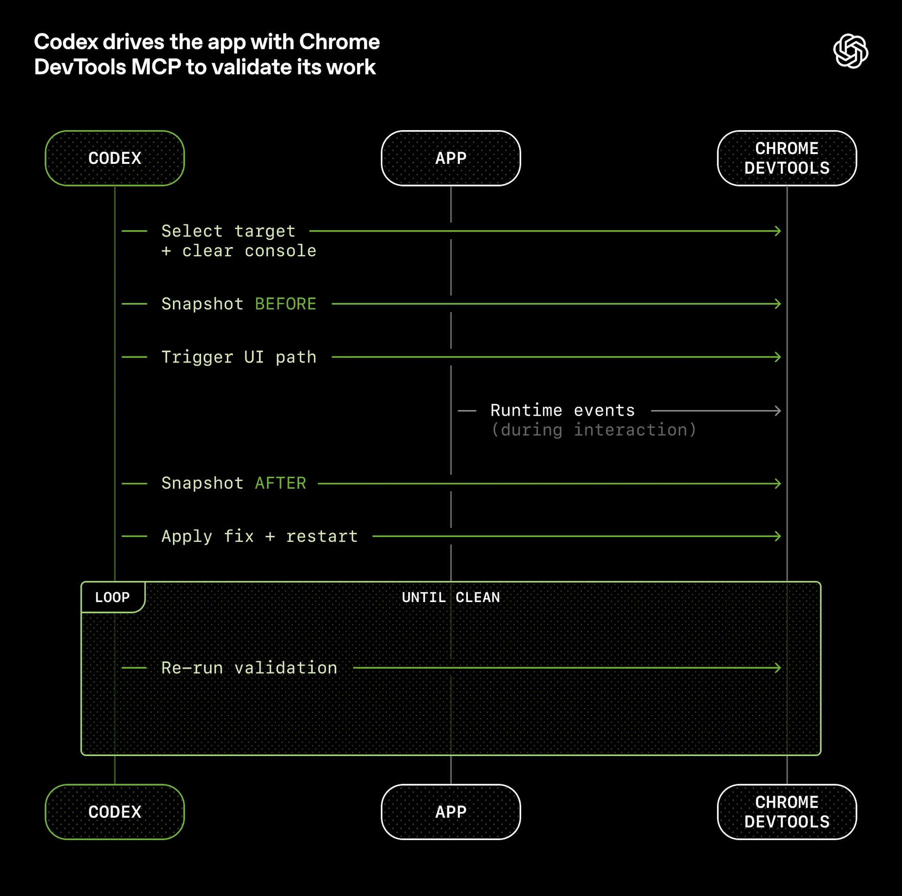
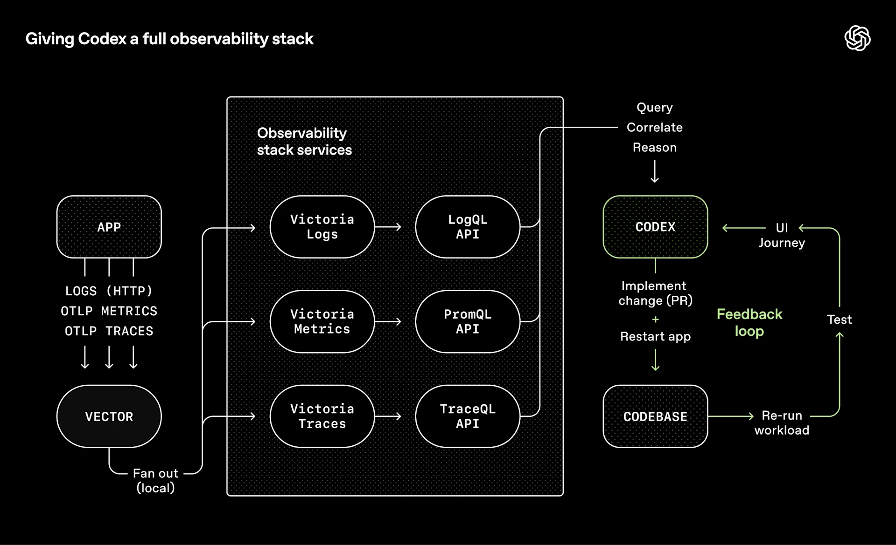
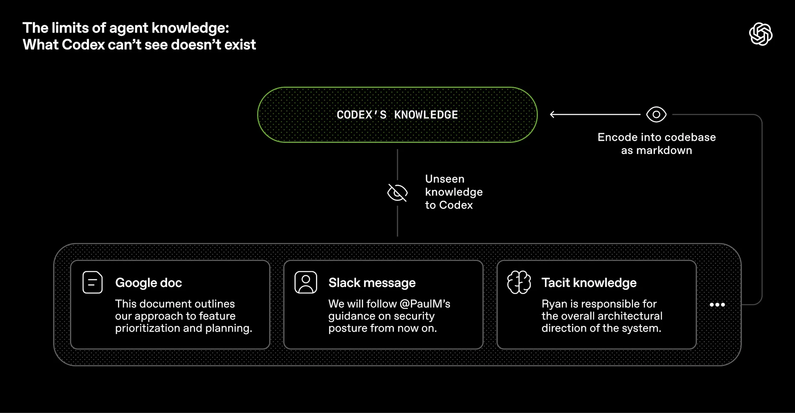
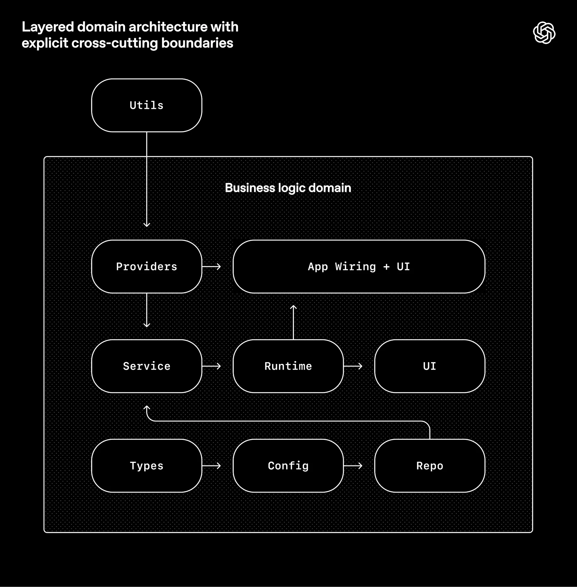

# 들어가며

이 글은 OpenAI에서 작성한 '하네스 엔지니어링: 에이전트 우선 세계에서 Codex 활용하기' 를 정리한 글입니다. 원본은 다음 링크를 통해 확인할 수 있습니다: https://openai.com/ko-KR/index/harness-engineering/ (원본 작성일: 2026년 2월 11일)

---

# 도입

- OpenAI 에서는 작성일 기준으로 5개월 간 수동으로 코드를 전혀 작성하지 않고 SW를 구축하고 출시하는 실험을 진행함.
- 실험에서 작성된 모든 코드가 Codex에 의해 작성됨.
- 수작업 대비 1/10 정도의 시간으로 작성된 것으로 추정.
- **사람이 조정하고, 에이전트가 수행**
	- 엔지니어링 속도를 몇 배로 높이는 데 필요한 것을 구축하기 위해 의도적으로 이 제약을 선택함.
- SW 엔지니어링 팀의 주 업무가 더 이상 코드 작성이 아님. 환경을 설계하고, 의도를 명시하며, Codex 에이전트가 안정적인 작업을 수행할 수 있도록 피드백 루프를 구축하는 것이 주 업무.

# 빈 git 리포지터리로 시작함

- 빈 리포지터리에 대한 첫 커밋은 2025년 8월 말에 이루어짐.
- 초기 프로젝트 구조는 Codex가 만듦. 초기 AGENTS.md 파일도 Codex가 직접 작성함.
- 5개월 후 리포지터리에는 약 백만 줄의 코드가 작성됨.
- 5개월 간 3명의 엔지니어로 구성된 소규모 팀이 약 1,500개의 PR을 열고 병합함.
	- 엔지니어 1인당 하루 평균 3.5개의 PR 처리량
- 7명의 엔지니어로 팀이 성장하면서 처리량이 증가함. 떨어지지 않음.
- 이 실험에서 사용한 제품은 매일 사용하는 내부 파워 유저를 포함해 수백 명의 사용자가 내부적으로 사용해 옴.
	- 단지 출력을 위한 출력이 아님.
- 개발 과정 전반에 걸쳐 사람은 코드에 직접 기여하지 않음. 수동으로 작성한 코드가 없음.

# 엔지니어의 역할 재정의하기

- 사람이 직접 코딩을 하지 않기 때문에 시스템, 스캐폴딩, 레버리지에 중점을 둔 다른 종류의 엔지니어링 작업이 필요했음.
- 초기 진행은 예상보다 더뎠음.
	- Codex의 역량 부족이 아니라, 환경이 제대로 갖춰지지 않았기 때문.
	- 에이전트가 상위 목표를 달성하기 위한 도구, 추상화, 내부 구조가 부족했음.
- 엔지니어링 팀의 주요 업무는 에이전트가 유용한 업무를 수행할 수 있도록 지원하는 것이 됨.
- 큰 목표를 더 작은 빌딩 블록(설계, 코드, 검토, 테스트 등)으로 세분화하고 에이전트가 이러한 블록을 구성하도록 유도한 다음 이를 사용하여 더 복잡한 작업을 해결하는 깊이 우선 작업 진행.
- 실패했을 때 엔지니어들은 항상 작업에 직접 투입되어 "어떤 기능이 누락되어 있으며, 에이전트가 읽기 쉽고 실행 가능하게 하려면 어떻게 해야할까?"라는 고민을 함.
- 엔지니어가 작업을 설명하고, 에이전트를 실행하고, PR을 열도록 허용하는 등 사람은 거의 전적으로 프롬프트를 통해 시스템과 상호작용함.
- PR을 완료하기 위해, Codex에게 로컬에서 자체 변경 사항을 검토하고, 로컬 및 클라우드에서 특정 에이전트 검토를 추가로 요청하고, 사람이나 에이전트가 제공한 피드백에 응답하고, 모든 에이전트 검토자가 만족할 때까지 반복하도록 지시함.
	- 사실상 랄프 위검 루프임.
- 사람이 PR을 검토할 수는 있지만, 반드시 필요한 작업은 아님.
	- 시간이 지남에 따라 거의 모든 검토 작업을 에이전트 간에 처리되도록 전환해 옴.

# 애플리케이션의 가독성 향상

- 코드 처리량이 증가하면서, 인적 QA 역량에 병목 현상이 발생함.
- 사람의 시간, 주의력이 고정된 제약이었기 때문에 애플리케이션 UI, 로그, 앱 메트릭 등을 Codex가 직접 읽고 이해할 수 있도록 하여 에이전트에 더 많은 기능을 추가하기 위해 노력해 옴.
- 예를 들어, git worktree 별로 앱을 부팅할 수 있게 하여 Codex가 변경사항마다 하나의 인스턴스를 실행하고 제어할 수 있도록 함. 또한 Chrome DevTools Protocol을 에이전트 런타임에 연결하고 DOM 스냅샷, 스크린샷, 탐색 작업을 위한 스킬을 만듦. 이를 통해 Codex는 버그를 재현하고, 수정사항을 검증하며, UI 동작에 대해 직접 추론할 수 있었음.



- 관측 가능성 툴링에서도 마찬가지.
- 로그, 메트릭, 추적은 각 워크트리에 대해 일시적으로 유지되는 로컬 관측 가능성 스택을 통해 Codex에 노출됨. Codex는 해당 앱의 완전히 격리된 버전(로그와 메트릭 포함)에서 작업하며, 작업이 완료되면 로그와 메트릭은 삭제됨.
- 에이전트는 LogQL로 로그를 쿼리하고 PromQL로 메트릭을 쿼리할 수 있음. 이러한 컨텍스트가 주어지면 "서비스 시작이 800ms 이내에 완료"되도록 하거나 "이 네 가지 핵심 사용자 여정에서 어떤 스팬도 2초를 초과하지 않도록" 하는 등의 프롬프트를 다루기 쉬워짐.



- 한 번의 Codex 실행으로 6시간 이상(종종 사람이 잠자는 동안) 한 가지 작업을 수행하는 경우가 많음.

# 리포지터리 지식을 기록 시스템으로 만듦

- 컨텍스트 관리는 에이전트가 크고 복잡한 작업을 효과적으로 수행하는 데 있어 가장 큰 과제 중 하나임.
- 초기에 배운 간단한 교훈 중 하나는 Codex에 1,000페이지의 설명서가 아닌 맵을 제공해야 한다는 것.
- "하나의 큰 `AGENTS.md`" 접근 방식을 시도해 봤지만 다음과 같이 예측 가능한 방식으로 실패함.
	- 컨텍스트는 희소 리소스.
		- 거대한 지침 파일로 인해 작업, 코드 및 관련 문서가 복잡해져서 에이전트가 주요 제약 조건을 놓치거나 잘못된 제약 조건에 맞게 최적화 시작하게 됨.
	- 지침이 너무 많으면 지침이 되지 않음.
		- 모든 것이 중요하면 중요한 것은 아무것도 없음.
	- 순식간에 망가짐.
		- 확일적인 거대 메뉴얼은 낡은 규칙들의 무덤으로 변함.
		- 에이전트는 무엇이 여전히 사실인지 알 수 없고, 사람들은 더 이상 이를 유지관리하지 않으며, 파일은 조용히 매력적인 골칫거리로 변함.
	- 확인하기 어려움.
		- 단일 블롭은 기계적 점검(커버리지, 신선도, 소유권, 교차 연결)에 적합하지 않으므로 드리프트는 불가피함.
- `AGENTS.md` 를 백과사전으로 취급하는 대신 목차로 취급함.
- 리포지터리의 지식 베이스는 기록 시스템으로 취급되는 구조화된 `docs/` 디렉터리에 잇음. 짧은 `AGENTS.md`(약 100줄)는 컨텍스트에 삽입되어 주로 맵 역할을 하며, 다른 곳에 있는 더 심층적이고 신뢰할 수 있는 정보 소스를 알려준다.

```
AGENTS.md
ARCHITECTURE.md
docs/
├── design-docs/
│   ├── index.md
│   ├── core-beliefs.md
│   └── ...
├── exec-plans/
│   ├── active/
│   ├── completed/
│   └── tech-debt-tracker.md
├── generated/
│   └── db-schema.md
├── product-specs/
│   ├── index.md
│   ├── new-user-onboarding.md
│   └── ...
├── references/
│   ├── design-system-reference-llms.txt
│   ├── nixpacks-llms.txt
│   ├── uv-llms.txt
│   └── ...
├── DESIGN.md
├── FRONTEND.md
├── PLANS.md
├── PRODUCT_SENSE.md
├── QUALITY_SCORE.md
├── RELIABILITY.md
└── SECURITY.md
```

- 설계 문서화는 검증 상태와 핵심 설계 원칙을 함께 기록하고, 인덱스로 관리됨.
- `ARCHITECTURE.md`는 도메인과 패키지 레이어링의 최상위 맵을 제공함.
	- https://matklad.github.io/2021/02/06/ARCHITECTURE.md.html
- 품질 문서는 각 제품 도메인과 아키텍처 레이어에 품질 수준 등급을 매기며, 시간이 지남에 따라 쌓이는 격차를 추적함.
- 계획은 일급 아티팩트로 간주됨.
	- 계획이 구현을 위한 일회성 입력값이 아니라, 소프트웨어 프로젝트를 구성하는 하나의 지속적인 산출물이라는 의미.
	- 코드만 프로젝트의 결과물이 아니라 문서도 프로젝트의 결과물.
- 복잡한 작업의 계획은 일회성 메모가 아니라 Git에 저장되는 정식 산출물로 관리함.
	- 진행 상황, 주요 의사결정과 이유, 발견된 문제와 기술 부채
- 작은 변경은 가벼운 임시 계획으로 처리하고, 복잡한 작업만 실행 계획을 남김.
- 진행 중인 계획, 완료된 계획, 기술 부채를 한곳에 보관해 에이전트가 과거 결정의 맥락을 스스로 복원할 수 있게 함.
- 모든 문서를 처음부터 제공하지 않고, `AGENTS.md`를 출발점으로 필요한 문서만 찾아가게 함.
	- 에이전트는 처음부터 부담을 느끼지 않고 작고 안정적인 진입 지점에서 시작하여 다음 단계로 나아갈 수 있음.
- 문서 규칙 준수와 품질은 사람의 주의에 의존하지 않고 기계적으로 검증함.
	- 전용 린터와 CI 작업은 지식 베이스가 최신 상태이고, 교차 링크되어 있으며, 올바르게 구성되어 있는지 검증함.
	- 반복 실행되는 "doc-gardening" 에이전트가 실제 코드 동작을 반영하지 않는 오래되거나 더 이상 유효하지 않은 문서를 검토하여 수정 PR을 생성함.
- 핵심 목표는 에이전트가 외부 대화나 사람의 기억에 의존하지 않고 리포지터리만으로 현재 상태와 작업 맥락을 이해할 수 있게 만드는 것.

# 에이전트의 가독성이 목표

- 리포지터리가 전적으로 에이전트에 의해 생성되었기 때문에, 리포지터리와 코드가 우선적으로 Codex의 가독성에 최적화되어 있음.
	- 신입 엔지니어링 직원을 위해 코드의 탐색성을 개선하는 것과 마찬가지로, 인간 엔지니어의 목표는 에이전트가 리포지터리 자체에서 직접 전체 비즈니스 도메인에 대해 추론할 수 있도록 하는 것이었음.
- 코드베이스는 사람뿐 아니라 AI 에이전트가 쉽게 탐색하고 추론할 수 있도록 설계함.
- 에이전트가 실행 중 접근할 수 없는 정보는 사실상 존재하지 않는 정보와 동일하게 취급함.
	- Slack 대화, Google Docs, 특정 개발자의 머릿속 지식, 회의에서만 합의된 내용 등
- 따라서 중요한 맥락은 가능한 한 리포지터리 내부의 버전 관리되는 아티팩트로 옮김.
	- 코드, 마크다운 문서, 스키마, 실행 계획, 설계 원칙과 의사결정 등



- 에이전트에게 더 많은 컨텍스트를 준다는 것은 거대한 프롬프트를 제공하는 것이 아니라, 필요한 정보를 구조화하고 검색 가능한 형태로 노출하는 것.
- 제품 원칙, 엔지니어링 규범, 팀 문화까지도 신입 개발자를 온보딩하듯 에이전트가 이해할 수 있게 제공함.
- 기술 선택에서도 에이전트가 직접 이해, 검사, 검증할 수 있는 단순하고 예측 가능한 기술과 추상화를 선호함.
- 외부 라이브러리의 동작이 지나치게 불투명하다면, 필요한 기능만 직접 구현하는 것이 오히려 에이전트에게 더 유리할 수도 있음.
	- 예를 들어, OpenAI 팀은 범용 concurrency 라이브러리 대신 자체 헬퍼를 만들어 동작을 완전히 통제하고 테스트 및 관측 가능성과 긴밀하게 통합함.
- 궁극적인 목표는 에이전트가 외부의 숨겨진 맥락에 의존하지 않고 리포지터리만으로 비즈니스 도메인과 시스템을 이해하고 수정할 수 있게 만드는 것.

# 아키텍처 및 취향 강제 적용

- 문서화만으로는 일관성을 유지하기 어렵기 때문에, 중요한 아키텍처 규칙은 코드와 도구로 강제함.
- 구현 방법을 세세하게 지정하기보다 반드시 지켜야 하는 불변 조건(invariant)을 정의함.
	- e.g. 외부 데이터는 시스템 경계에서 파싱, 검증해야 함. 단, 이를 Zod로 할지 다른 방법으로 할지는 에이전트에 맡김.
- 에이전트는 명확한 경계와 예측 가능한 구조가 있을수록 안정적으로 작업하므로, 엄격한 아키텍처 모델을 사용함.
- 각 비즈니스 도메인은 정해진 레이어와 허용된 의존성 방향만 사용할 수 있음.
	- e.g. `Types -> Config -> Repo -> Service -> Runtime -> UI`
	- 인증, 텔레메트리, 기능 플래그 같은 횡단 관심사는 `Providers` 같은 명시적 인터페이스를 통해서만 접근
- 이러한 아키텍처 규칙은 사람이 코드 리뷰에서 매번 확인하는 것이 아니라 커스텀 린터와 구조적 테스트로 기계적으로 검증함.



- 이러한 종류의 아키텍처는 보통 수백 명의 엔지니어가 확보될 때까지 미루는 경우가 많음.
- 코딩 에이전트는 제약 조건이 있어야 성능 저하나 아키텍처 드리프트 없이 속도를 낼 수 있음.
- 아키텍처뿐 아니라 코딩 취향과 품질 기준도 자동화함.
	- 구조화된 로깅
	- 스키마, 타입 네이밍 규칙
	- 파일 크기 제한
	- 플랫폼별 안정성 요구사항
- 커스텀 린터의 오류 메시지에는 단순히 실패 이유만 표시하지 않고, 에이전트가 어떻게 수정해야 하는지도 함께 제공함.
- 사람에게는 지나치게 엄격해 보일 수 있는 규칙도, 에이전트 환경에서는 한 번 인코딩하면 모든 작업에 자동 적용되기 때문에 큰 레버리지가 됨.
- 반대로 모든 것을 통제하지는 않음. 중요한 경계와 불변 조건만 중앙에서 강제하고, 그 안의 구현 방식은 에이전트에게 자율성을 부여함.
- 따라서 목표는 특정 개발자의 코드 스타일을 그대로 재현하는 것이 아니라, 정확하고 유지보수 가능하고 다음 에이전트가 읽기 쉬운 코드를 만드는 것.
- 결과로 생성된 코드가 항상 인간의 문체 선호도와 일치하지 않을 수 있지만, 문제가 되지 않음. 출력이 정확하고, 유지관리 가능하며, 앞으로 에이전트 실행 시 읽기 쉽다면 기준을 충족하는 것임.
- 코드 리뷰나 버그를 통해 반복적으로 나타나는 인간의 선호는 문서화 하여 반영하고, 반드시 지켜야 할 규칙이라면 린터, 테스트 같은 실행 가능한 제약으로 승격함.

# 병합 철학을 변화시키는 처리량

- Codex의 처리량이 증가함에 따라 기존의 많은 엔지니어링 규범이 오히려 역효과를 내기 시작함.
- Codex로 인해 PR 생성, 수정 속도가 크게 증가하면서, 기존의 보수적인 병합 관행이 오히려 병목이 되기 시작함.
- 따라서 리포지터리는 최소한의 차단형 병합 게이트만 두고 운영함.
	- PR은 짧게 유지
	- 필요한 검증만 빠르게 통과
	- 불필요한 대기 시간을 줄임
- 테스트가 간헐적으로 실패하거나 사소한 문제가 있더라도, 항상 병합을 무기한 막기보다 후속 실행이나 후속 PR에서 빠르게 수정하는 경우가 많음.
	- 이러한 방식의 핵심 전제는 에이전트의 처리량이 사람의 검토, 주의력보다 훨씬 높다는 점임.
	- 이런 환경에서는 수정 비용은 낮고, 다시 PR을 만드는 비용도 낮으며, 반대로 병합을 기다리는 시간의 비용도 낮으며, 반대로 병합을 기다리는 시간의 비용은 커짐.
- 따라서 목표는 모든 변경을 병합 전에 완벽하게 만드는 것보다, 충분히 안전한 수준에서 빠르게 병합하고 문제를 신속하게 보정하는 쪽으로 이동함.
	- 이는 품질을 포기한다는 의미가 아니라, 품질 보증을 무거운 사전 게이트에만 의존하지 않고 자동화된 테스트, 에이전트 리뷰, 후속 수정 루프 전체에 분산시키는 접근임.
- 다만 OpenAI도 이 방식이 모든 팀에 적합한 것은 아니며, 처리량이 낮거나 수정 비용이 큰 환경에서는 기존처럼 강한 사전 검증이 더 적절할 수 있다고 명시함.

# "에이전트 생성"의 실제 의미

- 코드베이스가 에이전트에 의해 생성된다는 것은 단순히 애플리케이션 코드만 AI가 작성한다는 뜻이 아님.
- Codex는 다음과 같은 SW 개발 전반의 산출물을 직접 생성함.
	- 제품 코드와 테스트
	- CI 설정과 릴리스 도구
	- 내부 개발자 도구
	- 문서와 설계 기록
	- 평가 하네스
	- 코드 리뷰 코멘트와 그에 대한 응답
	- 리포지터리 관리 스크립트
	- 프로덕션 대시보드 정의 파일
- 즉 에이전트의 역할은 코드를 작성하는 보조 도구가 아니라, SDLC 전반을 수행하는 개발 주체에 가까움.
- 사람은 여전히 루프에 남아 있지만, 직접 구현하기보다 더 높은 추상화 수준에서 시스템을 조정함.
	- 어떤 작업을 우선할지 결정
	- 사용자 피드백을 수용 기준으로 변환
	- 에이전트가 만든 결과를 검증
- 에이전트가 어떤 작업에서 반복적으로 실패한다면, 단순히 더 좋은 프롬프트를 작성하는 것으로 끝내지 않음.
- 필요한 도구가 없는지, 가드레일이 부족한지, 문서나 컨텍스트가 부족한지를 찾아 환경 자체를 개선함.
- 그리고 그 개선 역시 사람이 직접 코딩하기보다 Codex가 수정사항을 작성하여 다시 리포지터리에 반영하도록 함.
- 에이전트는 별도의 수동 작업 없이 git, GitHub, CLI, 리포지터리 내부 도구 등 기존 개발 도구를 직접 사용함.
- 리뷰 피드백을 가져와 수정하고, 댓글에 응답하고, 변경사항을 푸시하며, 경우에 따라 자신의 PR을 squash, merge 하는 단계까지 수행함.
- 따라서 "에이전트 생성"의 핵심은 AI가 코드를 많이 작성하는 것이 아니라, SW를 만들고 검증하고 운영하는 과정 자체가 에이전트 중심으로 재구성되는 것임.

# 자율성 수준의 증가

- 테스트, 검증, 리뷰, 피드백 처리, 복구 같은 개발 루프를 리포지터리와 툴링에 직접 인코딩하면서 에이전트의 자율성이 크게 높아짐.
- 일정 수준을 넘으면 Codex는 단순 구현 보조가 아니라 새 기능이나 버그 수정을 처음부터 끝까지 주도할 수 있음.
- 한 번의 프롬프트만으로 에이전트가 다음 작업을 연속적으로 수행할 수 있음.
	- 현재 코드베이스 상태 확인
	- 버그 재현
	- 실패 상황 기록
	- 수정 구현
	- 애플리케이션 실행 및 수정 검증
	- 수정 결과 기록
	- PR 생성
	- 사람, 에이전트 리뷰 피드백 반영
	- 빌드 실패 감지 및 수정
	- 필요한 경우에만 사람에게 에스컬레이션
	- 최종 병합
- 핵심은 모델 자체의 능력만 높인 것이 아니라, 에이전트가 스스로 관찰하고 행동하고 검증하고 복구할 수 있는 환경을 구축했다는 점임.
- 사람은 모든 단계에 개입하지 않고, 판단이 필요한 예외 상황에서만 개입하는 형태로 역할이 바뀜.
- 따라서 자율성은 단순히 "에이전트에게 더 많은 권한을 준다"는 의미가 아니라, 실패를 스스로 발견하고 수정할 수 있는 폐쇄형 피드백 루프를 만들어 주는 것에 가까움.
- 다만 이러한 수준의 자율성은 Codex가 원래부터 일반적으로 제공하는 능력이라고 보기 어렵고, 해당 리포지터리의 구조, 도구, 검증 체계에 대한 상당한 투자의 결과임.
	- OpenAI도 비슷한 하네스 없이 그대로 일반화할 수 있다고 가정해서는 안 된다고 명시함.

# 엔트로피 및 가비지 컬렉션

- 에이전트의 자율성이 높아질수록 기존 코드베이스의 패턴을 그대로 복제하는 경향이 있음.
- 문제는 기존 패턴이 항상 좋은 것은 아니라는 점임.
	- 중복된 헬퍼
	- 일관되지 않은 구현 방식
	- 임시방편 코드
	- 잘못된 데이터 접근 패턴
- 이런 작은 편차가 계속 복제되면서 시간이 지날수록 코드베이스의 일관성이 무너지는 드리프트, 즉 엔트로피가 증가함.
- OpenAI 팀은 초기에 이런 문제를 사람이 직접 정리했지만, 한때 매주 금요일 하루를 AI Slop 정리에 사용할 정도로 비용이 커졌고, 결국 확장 가능한 방식이 아니라고 판단함.
- 그래서 좋은 코드베이스 상태를 유지하기 위한 Golden Principles를 리포지터리에 직접 인코딩함.
	- 직접 만든 로컬 헬퍼보다 공용 유틸리티를 우선
	- 데이터를 추측해서 접근하지 않고 경계에서 검증
	- 가능하면 타입이 지정된 SDK를 사용
- 즉 좋은 관행을 문서에만 적어두는 것이 아니라 에이전트가 반복적으로 따를 수 있는 규칙과 도구로 만듦.
- 별도의 Codex 백그라운드 작업이 주기적으로 코드베이스를 검사함.
	- Golden Principle에서 벗어난 코드 탐색
	- 품질 등급 업데이트
	- 필요한 리팩터링 식별
	- 정리용 PR 자동 생성
- 이러한 정리 PR은 작고 반복적으로 만들어 짧은 시간 안에 검토하거나 자동 병합할 수 있도록 함.
- 이를 OpenAI는 가비지 컬렉션에 비유함.
	- 기술 부채가 크게 쌓인 뒤 대규모 리팩터링하는 대신, 작은 부채를 지속적으로 탐지하고 제거.
- 기술 부채를 고금리 대출처럼 바라봄.
	- 방치할수록 잘못된 패턴이 다른 에이전트에 의해 다시 복제됨.
	- 결국 부채의 이자가 빠르게 커짐.
- 따라서 나쁜 패턴이 몇 달 동안 퍼지게 두지 않고 매일 또는 정기적으로 작은 단위로 제거하는 것이 중요함.
- 인간의 코드 리뷰 취향이나 설계 판단 역시 한 번 규칙으로 인코딩하면 이후 에이전트가 생성하는 전체 코드베이스에 반복적으로 적용할 수 있음.

# 우리가 여전히 배우고 있는 점

- 지금까지의 에이전트 중심 개발 방식은 실제 제품의 출시와 운영 단계에서도 잘 작동하고 있음.
- 다만 장기적으로 아직 검증되지 않은 부분이 많이 남아 있음.
    - 완전한 에이전트 생성 코드베이스가 수년 동안 아키텍처 일관성을 유지할 수 있을지 불확실함.
    - 인간의 판단이 어느 지점에서 가장 큰 가치를 가지는지 계속 탐색 중임.
    - 인간의 판단을 규칙, 도구, 피드백 루프로 어떻게 인코딩할지에 대한 고민이 필요함.
    - 모델 성능이 계속 향상될 때 현재의 하네스가 어떤 형태로 변화해야 할지도 아직 명확하지 않음.
- 에이전트 시대에도 소프트웨어 엔지니어링의 규율 자체가 사라지는 것은 아님.
- 다만 엔지니어링의 중심이 직접 코드를 잘 작성하는 것에서, 에이전트가 좋은 결과를 만들 수 있는 환경을 설계하는 것으로 이동하고 있음.
- 앞으로 더욱 중요해질 것으로 보이는 요소는 다음과 같음.
    - 코드베이스 일관성을 유지하는 툴링
    - 명확한 추상화와 아키텍처 경계
    - 자동화된 테스트와 검증
    - 빠른 피드백 루프
    - 에이전트의 행동을 제어하는 가드레일
- 현재 가장 어려운 문제는 에이전트를 단순히 더 똑똑하게 만드는 것이 아니라, 에이전트가 복잡한 소프트웨어를 안정적으로 구축하고 유지할 수 있는 환경과 제어 시스템을 만드는 것임.
- 에이전트가 SDLC에서 차지하는 비중이 커질수록, 직접 코딩하는 능력뿐 아니라 하네스와 개발 환경을 설계하는 능력의 중요성이 더욱 커질 가능성이 있음.
